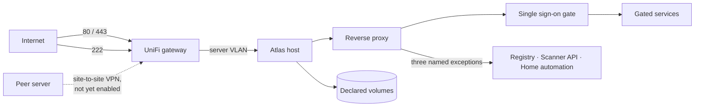

# Actors, Roles & Trust Boundary

This is the security baseline for Atlas. Every capability described elsewhere in the functional documentation inherits from it, and no feature may grant access this page does not describe.

## Trust boundary

Atlas is a **single host, deliberately exposed to the internet**. The boundary is not the local network — it is the machine itself, and it is crossed constantly by design.

Everything inside the host is treated as **hostile-adjacent**: a compromised container is assumed possible, and the design limits what one can reach rather than assuming none will happen.

| Boundary | What crosses it | Control |
| -------- | --------------- | ------- |
| Internet → gateway | HTTP, HTTPS, SSH | Port forwarding only for 80, 443 and the SSH port; everything else dropped |
| Gateway → host | The above, on a dedicated server VLAN | Gateway firewall rules isolate the server from personal devices |
| Host → containers | Nothing inbound except through the proxy | Host firewall default-deny; service ports bound to loopback |
| Container → container | Only within a declared private network | One private network per service and its own dependencies |
| Container → host | Nothing | Containers run unprivileged, as non-root, with a read-only root filesystem and no host paths beyond declared data volumes |
| Host → peer | Encrypted backup replicas | Private site-to-site link; never the public internet |

## Human actors

| Actor | Authenticates via | Second factor | Reaches |
| ----- | ----------------- | ------------- | ------- |
| **Maintainer (shell)** | SSH key only | Not required — key possession is the factor | The host itself, as an unprivileged user with password-protected elevation |
| **Maintainer (web)** | Single sign-on gate | Mandatory | Every service, including administrative interfaces |
| **Household member** | Single sign-on gate | Mandatory | Home automation and the service dashboard only |
| **Anonymous visitor** | None | — | Public container packages, and published applications marked public |

Root login is disabled entirely. Passwords are never accepted for SSH. There is no self-service account creation: accounts are declared in the repository and created by a converge.

## Machine actors

| Actor | Authenticates via | Reaches | Revocable independently |
| ----- | ----------------- | ------- | ----------------------- |
| **Continuous integration** | Registry push token | Registry write, scanner analysis API | Yes |
| **Workstation** | Registry pull token | Registry read | Yes |
| **Backup job** | Object-storage key, held only on the host | Its own bucket, nothing else | Yes |
| **Hosted application** | Object-storage key, one per application | Its own bucket, nothing else | Yes |
| **Peer server** | Cluster credential over the private link | Its own quota-capped tenancy | Yes |

No machine actor holds a credential that reaches beyond its single purpose. In particular, **no application ever holds the backup key**.

## Roles

Two roles exist. A third is defined but unused, so that adding a collaborator later is a configuration change rather than a redesign.

| Role | Members | Intent |
| ---- | ------- | ------ |
| `admin` | The maintainer | Full access to every service and administrative interface |
| `household` | Partner, family | Home automation and the dashboard; nothing operational |
| `collaborator` | *(none today)* | Reserved for a future technical user: registry and code quality, no administration |

## Permission matrix

Every feature must appear in this table. Adding a role means giving it a value in every row; adding a feature means giving every role a value in the new row.

| Feature | `admin` | `household` | `collaborator` | Anonymous |
| ------- | ------- | ----------- | -------------- | --------- |
| [Host shell](/atlas/functional/features/hardening) | Full | None | None | None |
| [Service dashboard](/atlas/functional/features/unified-theme) | View | View | View | None |
| [Ingress administration](/atlas/functional/features/ingress) | View routing state | None | None | None |
| [Identity administration](/atlas/functional/features/identity) | Manage own factors; users via repository | Manage own factors | Manage own factors | None |
| [Registry — public packages](/atlas/functional/features/registry) | Read/write | None | Read | Read |
| [Registry — private packages](/atlas/functional/features/registry) | Read/write | None | Read | None |
| [Code quality](/atlas/functional/features/code-quality) | Full | None | View results | None |
| [Home automation](/atlas/functional/features/home-automation) | Full | Control own home | None | None |
| [Object storage](/atlas/functional/features/object-storage) | Administer | None | None | None |
| [Observability](/atlas/functional/features/observability) | Full | None | None | None |
| [Backup & recovery](/atlas/functional/features/backup) | Full | None | None | None |
| [Application hosting](/atlas/functional/features/app-hosting) | Deploy and administer | Use, if the app is household-facing | None | Use, if the app is public |
| [Shell environment](/atlas/functional/features/shell-environment) | Full | None | None | None |

## Rules

1. **Two factors, always.** Every human web session requires a second factor. There is no per-service exemption and no trusted-network bypass.
2. **The gate fails closed.** If the single sign-on service is unreachable, gated requests are refused. An outage must never become an exposure.
3. **Exceptions are named, not general.** Only the three endpoints listed in the [functional overview](/atlas/functional/) bypass the gate, each with its own compensating control.
4. **Least privilege for machines.** One credential, one purpose, independently revocable.
5. **No shared accounts.** Every human has their own identity; no household password is passed around.
6. **The repository is the source of truth.** Accounts, roles and access rules are declared in code. A change made through a service's own interface is drift and will be overwritten.
7. **Recovery does not depend on the gate.** SSH access with a key is the recovery path when the web stack is broken.

## Accepted risks

These are deliberate decisions, recorded here so they stay visible rather than being rediscovered later.

| Risk | Why it is accepted |
| ---- | ------------------ |
| SSH is reachable from the internet | Key-only authentication with root disabled makes brute force structurally impossible, and it is the recovery path when everything else fails |
| The gate is a single point of failure for all gated services | Recovery is via SSH; the alternative — failing open — would be far worse |
| Home automation authenticates through a community integration | The alternative was a separate password per household member, judged worse; a local administrator account remains as a recovery path |
| Backups live on the same physical disk as their source | Temporary, until the peer replica is enabled; recorded as the largest open risk in Atlas |
| A total host failure produces no alert | Alerting runs on the node it monitors; an external watchdog was considered and declined |
