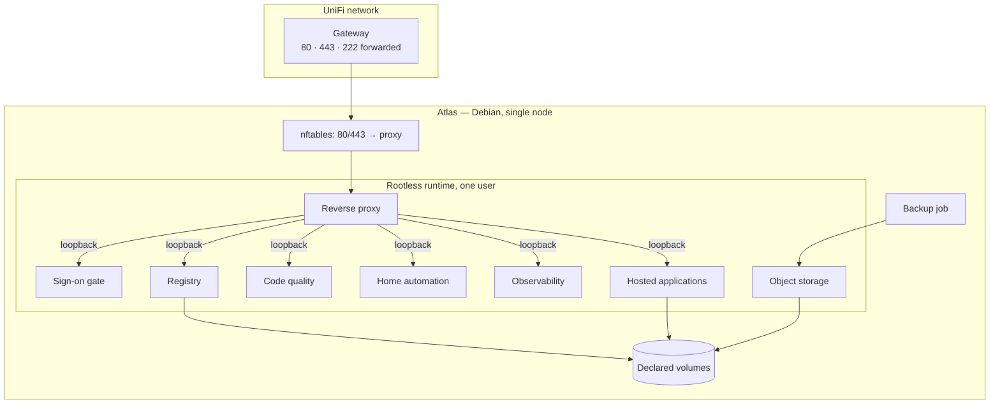

# Technical Documentation

How Atlas is actually built. Everything here follows from the [Functional Documentation](/atlas/functional/) and from the single architectural decision recorded in [ADR 001](/atlas/technical/adr/001-debian-docker-over-talos-kubernetes): **Debian and Docker, no orchestrator.**

## The shape of it

## Page map

| Page | Purpose |
| ---- | ------- |
| [Architecture](/atlas/technical/architecture) | Runtime model, service inventory, why ingress runs rootless behind nftables |
| [Storage Layout](/atlas/technical/storage-layout) | Volume table, reconciliation rules, the destructive playbook |
| [Network Topology](/atlas/technical/network-topology) | Ports, VLAN, DNS, certificates, container networks |
| [Security Model](/atlas/technical/security-model) | Hardening baseline, secrets, the three exceptions, threat notes |
| [Backup & Recovery](/atlas/technical/backup-recovery) | What is captured, and the runbooks for getting it back |
| [Ansible Conventions](/atlas/technical/ansible-conventions) | Repository layout, role structure, the idempotency rules |
| [Implementation Plan](/atlas/technical/implementation-plan) | Phased build order with acceptance criteria |
| [ADR Index](/atlas/technical/adr/) | The one recorded architectural decision |

## Fixed parameters

| Parameter | Value |
| --------- | ----- |
| Hardware | Repurposed desktop — i7, 32 GB RAM, one 4 TB NVMe, GPU present but inert |
| Operating system | Debian stable, conventionally installed |
| Starting point | Debian installed, SSH reachable; everything after that is Ansible's |
| Container runtime | Docker, rootless, one daemon under one service user — including the reverse proxy |
| Configuration tool | Ansible only — no Kubernetes, Talos, Helm, Nomad or Swarm |
| Execution | Manual, from the maintainer's workstation, over SSH |
| Secrets | Encrypted in the repository with per-value encryption and an age key |
| DNS | OVH, wildcard certificate issued by proving domain control |
| Address scheme | `<service>.atlas.<domain>` |
| Public ports | 80, 443, and SSH on an alternate external port |
| Filesystem | ext4 throughout, no disk encryption |
| Metrics retention | One year · **Logs** thirty days |
| Backup | Nightly; seven daily, four weekly, six monthly |
| Recovery target | Lose at most a day; running again within a weekend |
