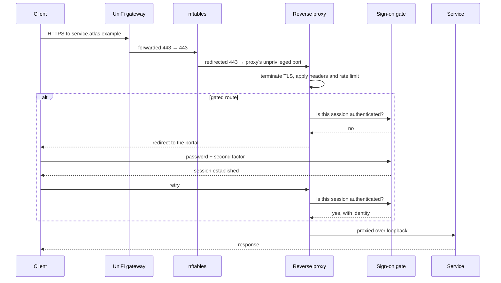

# Network Topology

## From the internet to a service

## Ports

| Port | Direction | Purpose |
| ---- | --------- | ------- |
| 80 | Inbound, forwarded unchanged, redirected by nftables to the proxy | Redirect to HTTPS, and domain-control validation |
| 443 | Inbound, forwarded unchanged, redirected by nftables to the proxy | All published services |
| External SSH port → 22 | Inbound, translated at the gateway | Administrative access, following the maintainer's existing convention |
| Git SSH port | Inbound | Repository access on the forge, enabled but unused |
| Loopback range | Host-internal only | Proxy to service; refused from anywhere else by the firewall |

The gateway forwards 80 and 443 **without translation**. The proxy itself never binds them — **nftables redirects both to the proxy's unprivileged ports** on the host, which is why the proxy runs rootless like everything else — see [Architecture](/atlas/technical/architecture).

## Placement

Atlas sits on a **dedicated server VLAN** on the UniFi network, isolated by gateway firewall rules from personal devices, and permitted into the device network only for the specific traffic home automation requires. That configuration lives in UniFi, not in Ansible, and is documented here as a prerequisite rather than automated.

The VPN is also the gateway's responsibility. Atlas has no VPN service of its own; clients that connect arrive as ordinary network clients.

## Names and certificates

- **Registrar and DNS:** OVH.
- **Scheme:** `<service>.atlas.<domain>`, so the project is namespaced under one label and the parent domain stays free.
- **Certificate:** a single wildcard for `*.atlas.<domain>`, obtained by proving control of the domain through DNS records created via the registrar's API. Credentials are scoped to zone operations and stored encrypted.
- **Why domain control rather than a web challenge:** it permits a wildcard, works without exposing anything during issuance, and keeps individual service names out of public certificate transparency logs.
- **Public address:** static, so a single record and no dynamic updater.

## Container networks

| Network | Members | Purpose |
| ------- | ------- | ------- |
| One per service | A service and its own database or broker | The isolation that matters: a compromised application cannot reach another service's database |
| Egress | Rootless containers | Outbound internet |
| Loopback publication | Proxy to services | The proxy is deliberately not joined to any service's private network; it reaches them only through loopback-published ports, so segmentation holds regardless of which runtime it sits in |

Home automation is rootless by default. Its device coordinator is passed through as a hardware device with a stable identifier, so a reboot cannot reassign it. If a future device requires local network discovery, a single documented switch grants that one service host networking; nothing else changes.

## Bandwidth

Symmetric fibre with substantial upstream, so replication to the peer and public image pulls do not compete with household use. Registry egress is monitored regardless, because public packages are served anonymously and a popular link or an aggressive scraper is the realistic failure mode.
