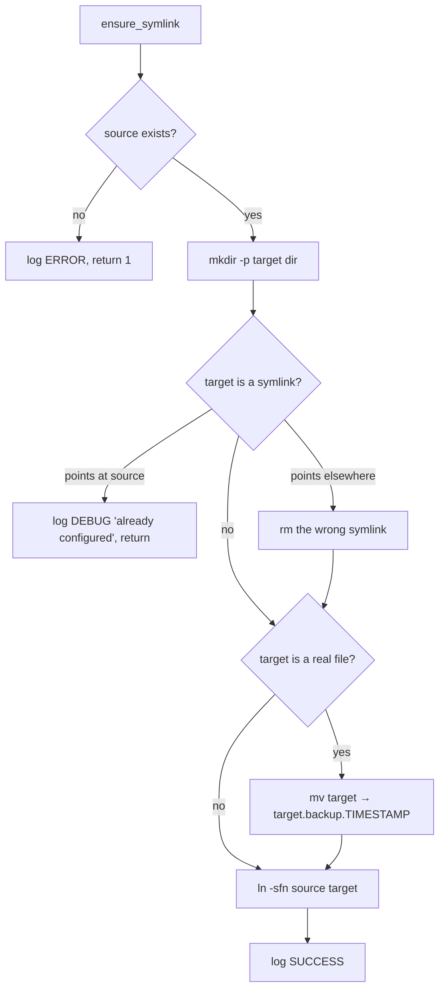
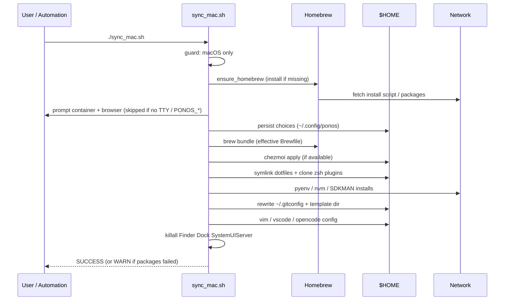
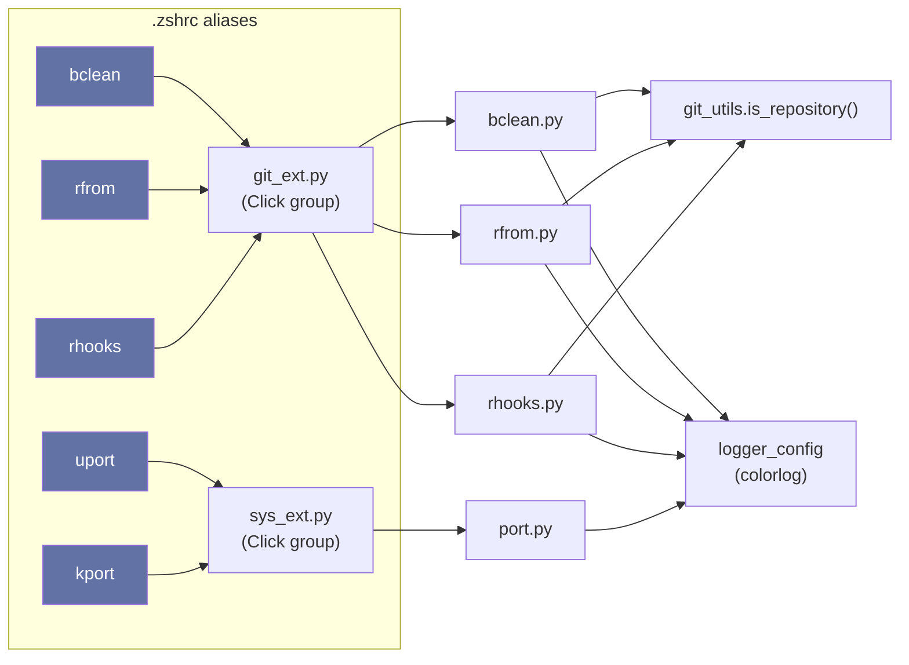

# Architecture

Ponos has three cooperating parts: a **bash orchestrator** (`sync_mac.sh`), a set of **tracked configuration** (the `Brewfile` and `dotfiles/`), and a small suite of **Python/Click CLIs** (`scripts/` and the Git template hooks). This page explains how they are built and how a run flows.

## Repository layout

```
Ponos/
├── sync_mac.sh                     # the orchestrator (single entry point)
├── Brewfile                        # declarative package list
├── dotfiles/
│   ├── zsh/.zshrc                  # shell init + aliases + env vars
│   ├── starship/config.toml        # prompt (Dracula palette)
│   ├── ssh/config                  # ssh hosts (keys via Bitwarden agent)
│   ├── vim/vimrc                   # editor config
│   ├── vscode/{settings,keybindings}.json, extensions.txt
│   ├── opencode/{config,tui}.json  # AI assistant config
│   └── git/
│       ├── ignore                  # global excludes file
│       └── git-templates/hooks/    # commit-msg, pre-push, utils.py
└── scripts/
    ├── git_ext.py                  # Click group: bclean / rfrom / rhooks
    ├── sys_ext.py                  # Click group: uport / kport
    ├── bclean.py, rfrom.py, rhooks.py, port.py   # command implementations
    ├── git_utils.py                # is_repository()
    └── logger_config.py            # colorlog logger
```

## The orchestrator

`sync_mac.sh` is a single bash script run with `set -euo pipefail`. Its design rests on a few building blocks:

### Logging

A `log LEVEL message…` function prints an ANSI-coloured, timestamped, level-tagged line. The palette (`DEBUG`/`SUCCESS` green, `INFO` white, `WARN` yellow, `ERROR` red, `CRITICAL` red-on-white) matches the Python `colorlog` configuration used by the CLIs and hooks, so all Ponos output looks the same regardless of language.

### Idempotency & the symlink/backup model

The core primitive is `ensure_symlink source target label`:



This is what makes the whole run **safe to repeat**: a correct link is a no-op, a wrong link is corrected, and a real user file is never destroyed — it is moved aside with a timestamp first. The same idempotent guard pattern (check-then-act) is used for plugin clones, theme installs, toolchain installs and the font.

### Fail-soft package installation

`build_effective_brewfile` copies the tracked `Brewfile` to a temp file and appends the interactive selections, then `brew bundle` runs against it. A non-zero result sets a `brew_bundle_failed` flag but does **not** abort — the remaining configuration still runs, and the final message reflects the warning. The temp file is always removed.

### End-to-end run flow



## The CLI extensions

Two Click command groups expose the developer helpers; the `.zshrc` aliases call them with `python3`:



Each command:

- reads its defaults from environment variables (`GIT_DEFAULT_BRANCH`, `GIT_PATH_CONFIG`, `GIT_PATH`) so they behave like first-class Git subcommands;
- shells out to `git` / `lsof` / `kill` via `subprocess` and inspects the output;
- logs through the shared `colorlog` logger; and
- accepts a `--debug` flag that re-raises the underlying exception instead of exiting quietly.

## The Git template hooks

Because `setup_git` sets `init.templateDir` to `dotfiles/git/git-templates`, every `git init`/`git clone` copies the `hooks/` directory into the new repository:

- **`commit-msg`** parses the message, matches it against the Conventional-Commit keyword set, prefixes `wip` messages with `[skip ci]`, or synthesises a conforming message from the branch name (keyword + trailing path segment as scope). It rewrites the commit-message file in place or exits non-zero to reject the commit.
- **`pre-push`** reads the last command from `~/.zsh_history` to detect a force push, checks the current branch against the protected set, and prompts on `/dev/tty` for confirmation before allowing the push.

Existing repositories don't get template changes retroactively — [`rhooks`](/ponos/technical/cli-reference#rhooks) copies the latest hooks into every `.git/hooks` under a directory tree on demand.

## Design properties

| Property | How it is achieved |
| -------- | ------------------ |
| **Idempotent** | Check-then-act guards everywhere; symlink correctness is detected. |
| **Non-destructive** | Real files are backed up with a timestamp before replacement. |
| **Fail-soft** | Package and toolchain failures warn and continue rather than abort. |
| **Unattended-capable** | TTY detection + `PONOS_*` overrides + persisted choices. |
| **Consistent UX** | Shared colour palette across bash and Python output. |
| **Single source of truth** | The repo declares state; the machine is reconciled to it. |
