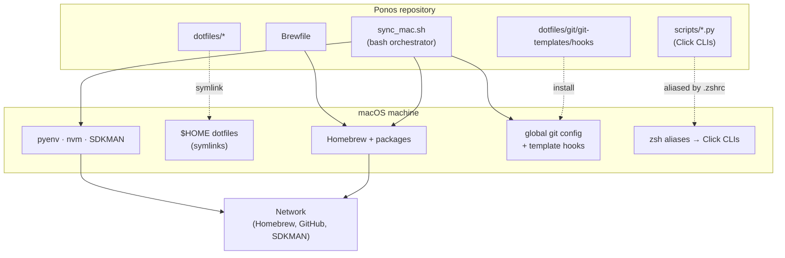

# Technical Documentation

This section covers the engineering of Ponos: the single-script orchestrator, the symlink-based dotfiles model, the Python/Click CLI extensions, the Git template hooks, and the Architecture Decision Records that justify each choice. It assumes the [Functional Documentation](/ponos/functional/) — especially the [Actors & Trust Boundary](/ponos/functional/roles-and-permissions) baseline — is understood.

## System at a glance

Ponos is not a running service; it is a **repository of code and configuration** plus one orchestrator that reconciles a macOS machine to the state that repository declares.



The orchestrator installs Homebrew and packages, symlinks the dotfiles, installs the language toolchains, writes the global Git config and template hooks, and wires the shell aliases that expose the Python CLIs. Everything runs as the invoking user; the network is used to fetch Homebrew, packages, plugins and runtimes.

## Documentation map

| Page | Purpose |
| ---- | ------- |
| [Getting Started](/ponos/technical/getting-started) | Prerequisites and the exact procedure to run Ponos on a fresh Mac |
| [Architecture](/ponos/technical/architecture) | The orchestrator's structure, the idempotency and backup model, and how a run flows end to end |
| [CLI Reference](/ponos/technical/cli-reference) | Every alias, Click command, flag and Git alias, with defaults |
| [Configuration](/ponos/technical/configuration) | Environment variables, the persisted choices file, the Brewfile, and managed paths |
| [ADR index](/ponos/technical/adr/) | All Architecture Decision Records, in causal order |

## Stack summary

| Concern | Choice |
| ------- | ------ |
| Orchestrator | Bash (`set -euo pipefail`), idempotent, macOS-guarded |
| Package manager | Homebrew + `brew bundle` (declarative `Brewfile`) |
| Dotfiles | Symlinks with timestamped backups; optional chezmoi layer |
| Python | pyenv (latest stable 3.x) + `click`, `colorlog` |
| Node.js | nvm (LTS, default `lts/*`) |
| Java | SDKMAN (pinned Temurin LTS) |
| Shell | zsh + Starship prompt + autosuggestions + syntax-highlighting |
| CLI extensions | Python 3 + Click command groups (`git_ext`, `sys_ext`) |
| Git governance | Global config + `init.templateDir` hooks (`commit-msg`, `pre-push`) |
| Font | Hack Nerd Font (Homebrew cask) |
| Editors | Vim (+ Dracula), VS Code (curated extensions), Opencode |
| Logging | ANSI-coloured, level-tagged, timestamped (bash `log` + Python `colorlog`) |

## ADR format

Each ADR lives in `adr/[NNN]-[short-title].md` and follows this structure:

```markdown
# ADR NNN — Title

## Status

Accepted | Superseded by ADR NNN | Deprecated

## Context

What problem or constraint triggered this decision?

## Decision

What was decided?

## Consequences

Positive and negative trade-offs, and why the alternatives were rejected.
```
