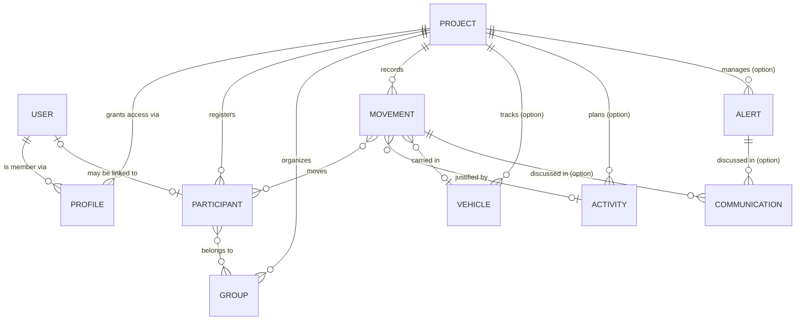

# Domain Model

This is the shared vocabulary of Registry — the entities the product talks about, how they relate, and the status values that make the live headcount work. It is deliberately business-facing; the database schema that backs it is in [Technical → Data Model](/registry/technical/data-model).

## The big picture

Everything except users lives **inside a project**. A project is the tenant boundary: two events never share participants, groups, movements or any other resource.

## Entities

### Project

An event to manage. It has a **name**, an optional **start** and **end** (each a date with an optional time), and a set of enabled **options**. When both dates are set, a project is *available* while the current moment sits inside that start–end window, and *unavailable* otherwise; with no dates, it is permanently available. Disabling a project hides it and freezes everything inside, independent of its dates.

### Profile

A user's membership of one project. It carries the user's **project role**, an optional **access window** (start/end), and an **invitation status** (`INVITED`, `ACCEPTED`, `REJECTED`, `BLOCKED`). A profile with no access window is **permanent**; a profile with a window only grants permissions while the current moment sits inside it — a registered member is not required to be available for the whole event. A user picks one of their accepted profiles as the **active** profile; that choice is what puts them "inside" a given event.

### User

Someone who can sign in. Users are **global** — the only entity that is not owned by a project. A user has a name, an email, a **global role**, and preferences (theme, language, active profile). A user may be *blocked* (cannot sign in) or *anonymized* (permanently scrubbed for data-protection reasons).

### Participant

A person taking part in an event. A participant has a **name**, a **birthday** (used for the "majors vs minors" split and the birthdays panel), an optional **availability window**, and a **type**:

- **`REGISTERED`** — enrolled for the event. Their normal state is *present*; they generate `OUT` movements when they leave and `IN` movements when they return. Leaving is not final — unless the movement is specifically justified as a **definitive departure** (see below).
- **`GUEST`** — a visitor. Their normal state is *off-site*; they generate `IN` movements when they arrive and `OUT` movements when they leave. A guest's departure is always **final**: once a guest checks `OUT`, they are gone for good — there is no equivalent of the registered participant's temporary absence.

A participant may optionally be **linked to a user account**, but most participants are not users. A participant's availability window is optional; attending for the whole event is not required — see [Availability windows: priority and date resolution](#availability-windows-priority-and-date-resolution) for what applies when it's unset.

### Group

A named set of participants — a team, a unit, a tent. A group's own availability window is optional (see [Availability windows](#availability-windows-priority-and-date-resolution)) and it is used to **move and count people together**: selecting a group in a movement expands to its members. Registry tracks how many members are currently inside vs outside.

### Movement — the core record

A **check-in or check-out event**. Each movement has:

- a **timestamp** (defaults to "now");
- a **direction** — `IN` or `OUT`;
- a **content type** — `REGISTERED` or `GUEST`;
- a **set of participants** (chosen directly or by expanding groups), optionally each assigned to a **vehicle**;
- a **pool label** on each participant entry — a snapshot of the name of the group (in full or in part) that was expanded to produce it, captured at the moment of the movement. It has nothing to do with the vehicle or with car-sharing: it exists so a later change to a group's membership never has to be reconciled against past movements — the movement simply remembers what it recorded at the time;
- a **justification** — either a free **reason** or a linked **activity** (never both), whenever the movement takes a participant *away* from their normal state. When a movement simply **returns** someone to their normal state (a registered participant coming back `IN`, or a guest going `OUT`), justification isn't merely optional or left blank — **there is no reason/activity field to fill in at all** for that movement.

Movements are what the dashboard reads to compute presence. A special reason, **definitive departure**, marks a *registered* participant as gone for good — the equivalent state a guest reaches automatically on every `OUT`.

### Vehicle *(option)*

A vehicle available to the event: **licence plate**, **brand**, **model**, and an optional availability window (see [Availability windows](#availability-windows-priority-and-date-resolution)). Like participants, a vehicle is *in* or *out* depending on its latest movement, feeding the vehicle-presence card on the dashboard.

### Activity *(option)*

A planned activity or outing: **name**, **description**, a **duration**, an optional availability window (see [Availability windows](#availability-windows-priority-and-date-resolution)), and an **allowed-participants range** (minimum/maximum). An activity can be used as the reason for a movement, tying an outing to the people who went on it.

### Communication *(option)*

A timestamped **message** attached to either a movement or an alert (at least one of the two). Communications form the discussion thread around an operational event.

### Alert *(option)*

An **incident**: a **title**, a **timestamp**, and a **status** (`IN_PROGRESS`, `RESOLVED`, `CANCELED`). Alerts are raised from a movement's discussion and then tracked to resolution, with their own communication thread.

## Availability windows: priority and date resolution

Every availability window in Registry — project, participant, group, vehicle, activity — and every profile's access window share the same shape: an optional **start** and **end**, each a date with an optional time. But they don't all resolve the same way, and dates are important enough in Registry to spell this out explicitly.

### Priority: the most specific element wins

When an element has its own window, that window governs, full stop. When it doesn't, availability **falls back to the next level up**:

- **Vehicle** → falls back to its **project's** window.
- **Activity** → falls back to its **project's** window.
- **Group** → falls back to its **project's** window.
- **Participant** → falls back to the window of the **group(s)** it belongs to → falls back to its **project's** window. A participant who belongs to **more than one** group and has no window of their own is available whenever **any** of those groups covers the current moment — the union, not the intersection (the most permissive reading).
- **Project** sits at the top of that chain: with no window of its own, it is **permanently available** — there is nothing left to fall back to.
- **Profile** is the one exception, not part of that chain at all: a profile's access window is **independent of its project's**. This is deliberate — it must be possible to grant access before a project opens or after it closes (setup or wrap-up staff). A profile with no window of its own is simply **permanent**.

In short: a window only has to be set once, at whichever level is most convenient, and everything below it inherits it until something more specific overrides it. Only reaching the top of a chain (project, or profile independently) with still no dates means "permanently available."

### Date-without-time defaults

A window's `start` or `end` may be given as a date with no time — but never the other way round: a time supplied without a date is rejected (the same `@DateDefinedForTime` rule already enforced on a movement's own timestamp applies to every availability window).

When a bound is date-only:

- a **start** date defaults to `00:00:00.000`;
- an **end** date defaults to `23:59:59.999…` (end of day);
- both are resolved in **the same timezone as the moment they're compared against** — not a fixed timezone — so a project opening on "2026-07-10" means midnight local to whoever's request is being evaluated, not midnight UTC.

## Status vocabulary

These are the enumerations that appear throughout the product.

| Enumeration | Values | Meaning |
| ----------- | ------ | ------- |
| **Movement type** | `IN`, `OUT` | Direction of a check-in/out. |
| **Participant type** | `REGISTERED`, `GUEST` | Enrolled participant vs visitor — they move in opposite directions. |
| **Presence status** | `IN`, `OUT`, `UNAVAILABLE` | A participant's or vehicle's live state, derived from movements and the availability window. |
| **Availability status** | `AVAILABLE`, `UNAVAILABLE` | Whether a project, participant, group, vehicle, activity or profile is within its active window — its own if set, otherwise inherited (see [Availability windows: priority and date resolution](#availability-windows-priority-and-date-resolution)). |
| **Profile status** | `INVITED`, `ACCEPTED`, `REJECTED`, `BLOCKED` | Lifecycle of a project membership. |
| **Alert status** | `IN_PROGRESS`, `RESOLVED`, `CANCELED` | Lifecycle of an incident. |
| **Movement reason** | `EMERGENCY`, `LOGISTICS`, `PARTNER_ANIMATION`, `VISIT`, `SHOPPING`, `MEDICAL`, `DEFINITIVE_DEPARTURE`, `OTHER` | Why a movement happened. Each reason is valid only for a specific direction and participant type. |
| **Project option** | `VEHICLE`, `ACTIVITY`, `COMMUNICATION`, `ALERT` | The optional modules an event can enable. |
| **User type** | `USER`, `SERVICE_ACCOUNT` | A human account vs the system's own job-runner. |
| **Theme** | `SYSTEM`, `LIGHT`, `DARK` | A user's interface preference. |

### How reasons pair with direction and type

A movement's reason must be coherent with its direction and participant type — this is enforced, not merely advised:

| Reason | Applies to | Direction |
| ------ | ---------- | --------- |
| `SHOPPING`, `MEDICAL`, `DEFINITIVE_DEPARTURE`, `OTHER` | Registered participants leaving | `OUT` |
| `EMERGENCY`, `LOGISTICS`, `PARTNER_ANIMATION`, `VISIT` | Guests arriving | `IN` |

A registered participant with no reason and no activity is assumed to be **returning** (`IN`); a guest with no reason is assumed to be **leaving** (`OUT`). The [Movements feature](/registry/functional/features/movements) covers these rules in full.
