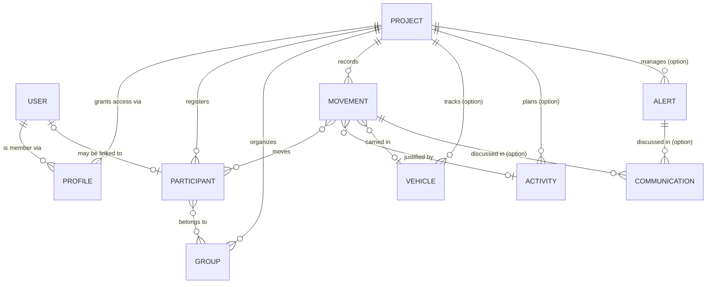

# Domain Model

This is the shared vocabulary of Registry — the entities the product talks about, how they relate, and the status values that make the live headcount work. It is deliberately business-facing; the database schema that backs it is in [Technical → Data Model](/registry/technical/data-model).

## The big picture

Everything except users lives **inside a project**. A project is the tenant boundary: two events never share participants, groups, movements or any other resource.

## Entities

### Project

An event to manage. It has a **name**, a **start** and an **end** (each a date with an optional time), and a set of enabled **options**. A project is *available* while the current moment sits inside its start–end window, and *unavailable* otherwise. Disabling a project hides it and freezes everything inside.

### Profile

A user's membership of one project. It carries the user's **project role**, an **access window** (start/end), and an **invitation status** (`INVITED`, `ACCEPTED`, `REJECTED`, `BLOCKED`). A user picks one of their accepted profiles as the **active** profile; that choice is what puts them "inside" a given event.

### User

Someone who can sign in. Users are **global** — the only entity that is not owned by a project. A user has a name, an email, a **global role**, and preferences (theme, language, active profile). A user may be *blocked* (cannot sign in) or *anonymized* (permanently scrubbed for data-protection reasons).

### Participant

A person taking part in an event. A participant has a **name**, a **birthday** (used for the "majors vs minors" split and the birthdays panel), an **availability window**, and a **type**:

- **`REGISTERED`** — enrolled for the event. Their normal state is *present*; they generate `OUT` movements when they leave and `IN` movements when they return.
- **`GUEST`** — a visitor. Their normal state is *off-site*; they generate `IN` movements when they arrive and `OUT` movements when they leave.

A participant may optionally be **linked to a user account**, but most participants are not users.

### Group

A named set of participants — a team, a unit, a tent. Groups have their own availability window and are used to **move and count people together**: selecting a group in a movement expands to its members. Registry tracks how many members are currently inside vs outside.

### Movement — the core record

A **check-in or check-out event**. Each movement has:

- a **timestamp** (defaults to "now");
- a **direction** — `IN` or `OUT`;
- a **content type** — `REGISTERED` or `GUEST`;
- a **set of participants** (chosen directly or by expanding groups), optionally each assigned to a **vehicle** and a **carpool label**;
- a **justification** — either a free **reason** or a linked **activity** (never both).

Movements are what the dashboard reads to compute presence. A special reason, **definitive departure**, marks a registered participant as gone for good.

### Vehicle *(option)*

A vehicle available to the event: **licence plate**, **brand**, **model**, and an availability window. Like participants, a vehicle is *in* or *out* depending on its latest movement, feeding the vehicle-presence card on the dashboard.

### Activity *(option)*

A planned activity or outing: **name**, **description**, a **duration**, and an **allowed-participants range** (minimum/maximum). An activity can be used as the reason for a movement, tying an outing to the people who went on it.

### Communication *(option)*

A timestamped **message** attached to either a movement or an alert (at least one of the two). Communications form the discussion thread around an operational event.

### Alert *(option)*

An **incident**: a **title**, a **timestamp**, and a **status** (`IN_PROGRESS`, `RESOLVED`, `CANCELED`). Alerts are raised from a movement's discussion and then tracked to resolution, with their own communication thread.

## Status vocabulary

These are the enumerations that appear throughout the product.

| Enumeration | Values | Meaning |
| ----------- | ------ | ------- |
| **Movement type** | `IN`, `OUT` | Direction of a check-in/out. |
| **Participant type** | `REGISTERED`, `GUEST` | Enrolled participant vs visitor — they move in opposite directions. |
| **Presence status** | `IN`, `OUT`, `UNAVAILABLE` | A participant's or vehicle's live state, derived from movements and the availability window. |
| **Availability status** | `AVAILABLE`, `UNAVAILABLE` | Whether a project, group, activity or profile is within its active window. |
| **Profile status** | `INVITED`, `ACCEPTED`, `REJECTED`, `BLOCKED` | Lifecycle of a project membership. |
| **Alert status** | `IN_PROGRESS`, `RESOLVED`, `CANCELED` | Lifecycle of an incident. |
| **Movement reason** | `EMERGENCY`, `LOGISTICS`, `PARTNER_ANIMATION`, `VISIT`, `SHOPPING`, `MEDICAL`, `DEFINITIVE_DEPARTURE`, `OTHER` | Why a movement happened. Each reason is valid only for a specific direction and participant type. |
| **Project option** | `VEHICLE`, `ACTIVITY`, `COMMUNICATION`, `ALERT` | The optional modules an event can enable. |
| **User type** | `USER`, `SERVICE_ACCOUNT` | A human account vs the system's own job-runner. |
| **Theme** | `SYSTEM`, `LIGHT`, `DARK` | A user's interface preference. |

### How reasons pair with direction and type

A movement's reason must be coherent with its direction and participant type — this is enforced, not merely advised:

| Reason | Applies to | Direction |
| ------ | ---------- | --------- |
| `SHOPPING`, `MEDICAL`, `DEFINITIVE_DEPARTURE`, `OTHER` | Registered participants leaving | `OUT` |
| `EMERGENCY`, `LOGISTICS`, `PARTNER_ANIMATION`, `VISIT` | Guests arriving | `IN` |

A registered participant with no reason and no activity is assumed to be **returning** (`IN`); a guest with no reason is assumed to be **leaving** (`OUT`). The [Movements feature](/registry/functional/features/movements) covers these rules in full.
