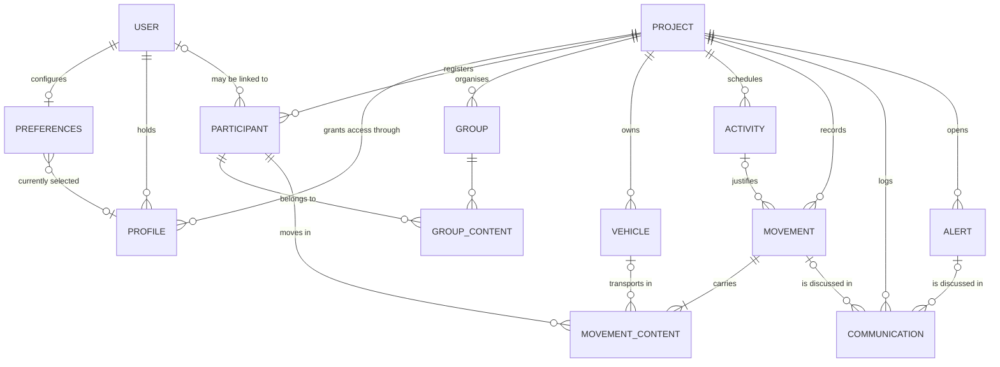
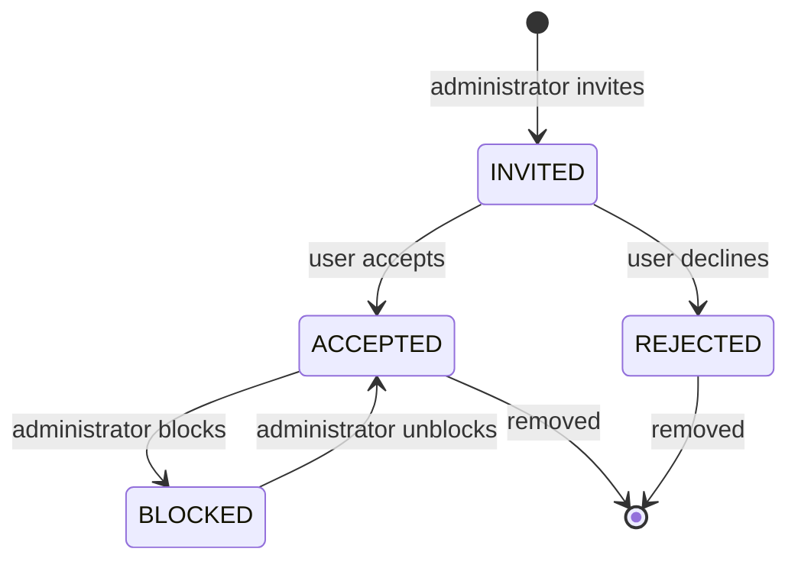
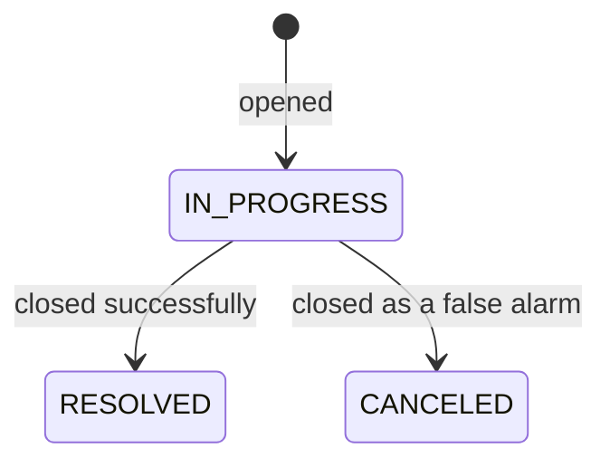
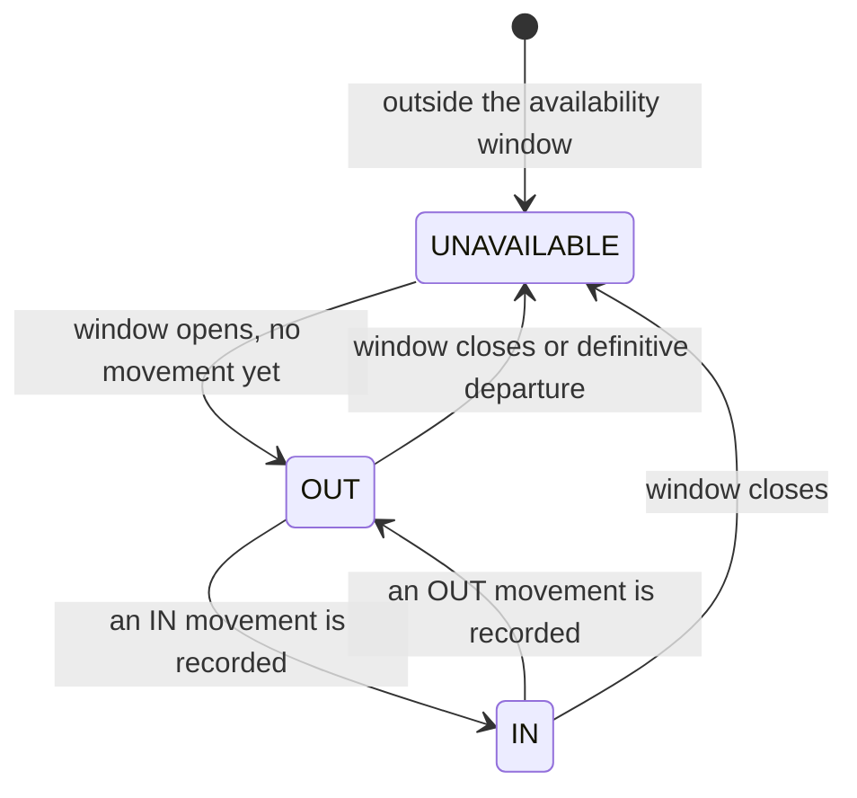

# Domain Model

Registry's domain has a shape worth understanding before reading any feature page, because two structural decisions explain most of its behaviour:

1. **Everything hangs off a project.** The project is the tenant. There is no shared reference data, no cross-project participant, no global group. Delete a project and its entire world goes with it.
2. **Presence is not stored.** No entity carries a "present" flag. Presence is read back from the movement log, every time it is asked for. That is why movements are protected far more carefully than anything else.

## The map

Read the diagram in three bands: **identity** at the top (users, profiles, preferences), **the project's world** in the middle (participants, groups, vehicles, activities), and **the record of what happened** at the bottom (movements, communications, alerts).

## Entities

### Identity

| Entity | What it is | Notable |
| ------ | ---------- | ------- |
| **User** | A platform account, created automatically on first sign-in | Carries a global role, an OIDC subject, an email, and flags for blocked and anonymised |
| **Preferences** | One row per user: theme, language, and the currently selected profile | The selected profile is what tells the application which project you are working in |
| **Profile** | The link between one user and one project | Carries the project role, a status, and an optional access window. **This is the unit of access.** |

### The project's world

| Entity | What it is | Notable |
| ------ | ---------- | ------- |
| **Project** | The tenant: name, date range, and enabled options | Everything below belongs to exactly one |
| **Participant** | A person tracked in the project | Either `REGISTERED` or `GUEST`; may be linked to a user account; has an availability window |
| **Group** | A named set of participants | Has its own availability window, which its members can inherit |
| **Vehicle** | A vehicle available to the project | Plate, brand, model, availability window. Requires the `VEHICLE` option |
| **Activity** | A named occupation with a duration and a participant range | Requires the `ACTIVITY` option; can justify a movement |

### The record

| Entity | What it is | Notable |
| ------ | ---------- | ------- |
| **Movement** | A dated `IN` or `OUT` event | Carries a content type, and either a reason or an activity |
| **Movement content** | One line of a movement: a participant, optionally a vehicle, optionally the name of the group they moved with | The join that makes a movement multi-person. The group name is **copied**, not linked — a snapshot that survives later membership changes |
| **Communication** | A timestamped message attached to a movement or an alert | Requires the `COMMUNICATION` option |
| **Alert** | An incident opened on the project, with a status | Requires the `ALERT` option |

### Access control tables

Roles and permissions are **data, not code**. Four tables — global permissions, global roles, project permissions, project roles — plus their two mapping tables define who may do what. Adding a permission to a role is a database migration, not a deployment of new logic.

## Two ideas that recur everywhere

### Visibility — the soft disable

Nearly every entity carries a visibility flag, and nearly every feature exposes *disable* and *enable* alongside *delete*. The distinction is deliberate:

| | Disable | Delete |
| --- | --- | --- |
| Reversible | ✅ | ❌ |
| Keeps history | ✅ | ❌ |
| Who may | Depends on the feature — often coordinators too | Administrators, almost always |
| Effect on presence | A hidden movement stops counting | The movement never existed |

Disabling is the everyday tool. Deletion is for genuine mistakes and for honouring erasure.

### Availability windows

Participants, groups, vehicles and activities all carry an optional start and end. The window decides whether the element is part of *today*:

- Inside the window → the element participates normally, and its presence is derived from its movements.
- Outside it → the element reads as `UNAVAILABLE`, whatever its movements say.
- A participant with **no window of its own inherits from its groups** — the earliest start and latest end among the visible groups it belongs to.
- A participant with no window and no group is treated as unavailable. Availability is opt-in, not assumed.

Every window must also sit **inside the project's own date range**, which is why changing a project's dates is refused when existing elements would fall outside the new range.

## Lifecycles

### A profile

Only `ACCEPTED` grants rights — and only while the access window is open. A profile created by **creating a project**, or as a **support profile**, starts at `ACCEPTED` directly; there is nobody to invite.

### An alert

An alert's content can only be edited while it is `IN_PROGRESS`, and only an `IN_PROGRESS` alert can receive new communications. Closing one freezes it.

### A participant's presence

Nothing in this diagram is stored. Each transition is a consequence of a movement being recorded, hidden or deleted, or of the clock passing an availability boundary.

## Referential rules

A handful of constraints keep the graph honest, and they surface as errors across many features:

- **No cross-project references, ever.** A movement can only reference participants, vehicles and activities of its own project.
- **Only visible elements can be referenced** by a new movement, group membership or communication.
- **A user may be linked to at most one participant per project.**
- **A group can never become empty** — removing or disabling the last member is refused. Delete the group instead.
- **Things that were used cannot simply vanish**: participants, vehicles and activities that appear in a movement, and alerts that carry communications, refuse deletion.
- **The last administrator is protected** — on both planes. The last global administrator cannot be demoted, blocked, anonymised or deleted; the last administrator of a project cannot lose that project.
