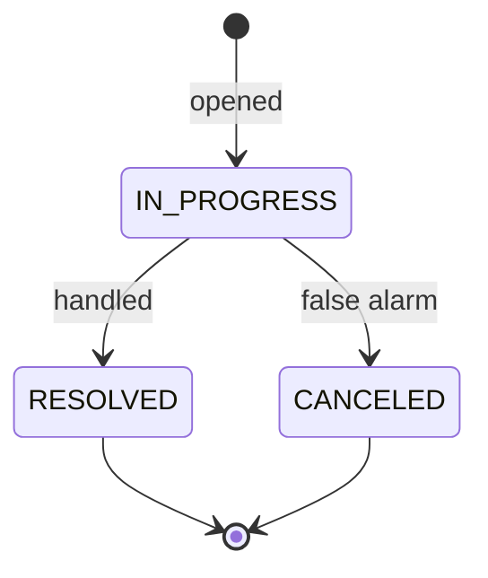

# Feature: Alerts

> A group is two hours overdue. Someone opens an alert, and from that moment every phone call, every sighting, every
> decision gets pinned to it. Three hours later the alert is resolved — and the whole sequence is still there, in order,
> for whoever has to explain it.

An alert is an incident: a titled, timestamped thing that is **open until it is closed**, gathering communications as it
goes.

Alerts sit at the top of the option chain — the project needs `ALERT`, which needs `COMMUNICATION`, which needs
`ACTIVITY`.

**Who this is for:** everyone with a profile. Whoever notices the problem opens the alert.

## Who can do what

| Role                    | May do                                                                                                | Limits                      |
|-------------------------|-------------------------------------------------------------------------------------------------------|-----------------------------|
| `PROJECT_ADMINISTRATOR` | Create · Read · Update · change status · Disable · Enable · **Delete** · read attached communications | Requires the `ALERT` option |
| `PROJECT_COORDINATOR`   | Create · Read · Update · change status · Disable · Enable · read attached communications              | Cannot delete               |
| `PROJECT_PARTICIPANT`   | Create · Read · Update · change status · Disable · Enable · read attached communications              | Cannot delete               |

Opening and **closing** an alert is available to every role. That is deliberate: an incident should never wait for an
administrator to be found.

## The life of an alert



`RESOLVED` and `CANCELED` are both terminal, and they mean different things — *"this happened and we dealt with it"*
versus *"this never really happened"*. Preserving that distinction is why there are two closing states rather than one.

## Open means editable; closed means frozen

This is the rule that shapes everything else:

| While `IN_PROGRESS`                    | Once closed                            |
|----------------------------------------|----------------------------------------|
| Title and date can be corrected        | Content is frozen — edits are rejected |
| New communications can be attached     | No new communications                  |
| Can be closed as resolved or cancelled | —                                      |

An alert is a live record while the situation is live, and evidence afterwards.

```gherkin
Scenario: Opening an alert
  Given the project has the ALERT option
  When I open an alert with a title and a date
  Then it is created with the status IN_PROGRESS

Scenario: Correcting an open alert
  Given an alert is IN_PROGRESS
  When I correct its title
  Then the change is saved

Scenario: Refusing to edit a closed alert
  Given an alert has been resolved
  When I try to change its title
  Then the request is rejected

Scenario: Closing an alert
  Given an alert is IN_PROGRESS
  When I set its status to RESOLVED
  Then it is closed and stops accepting communications
```

## What an alert carries

A **title** of up to 50 characters and a **date and time**, which must fall inside the project's own date range. The
status completes it. Alerts are searched by fuzzy text on the title and filtered by status, visibility and a date range.

Its **communications** are read as their own paginated thread, which is where the substance of an incident actually
lives.

```gherkin
Scenario: Refusing an alert outside the project's dates
  When I open an alert dated before the project begins
  Then it is rejected

Scenario: Refusing to move an alert away from its communications
  Given communications are attached to an alert
  When I move the alert to a time that leaves them outside it
  Then the change is rejected
```

## Disabling and deleting

Disabling hides an alert from the day-to-day list without erasing it — the way to clear a duplicate off the board.

Deletion is administrator-only and refused outright for **any alert that carries communications**. An incident that
generated a conversation cannot be made to disappear; empty the thread first, or hide the alert instead.

```gherkin
Scenario: Refusing to delete an alert with communications
  Given communications are attached to an alert
  When I try to delete it
  Then the request is rejected

Scenario: Denying deletion to a coordinator
  Given I hold the PROJECT_COORDINATOR role
  When I try to delete an alert
  Then the request is denied

Scenario: Denying alerts when the option is off
  Given the project does not have the ALERT option
  When I list the alerts
  Then the request is denied
```

## Related

- [Communications](/registry/functional/features/communications) — the thread an alert accumulates
- [Projects](/registry/functional/features/projects) — the option chain that unlocks alerts
