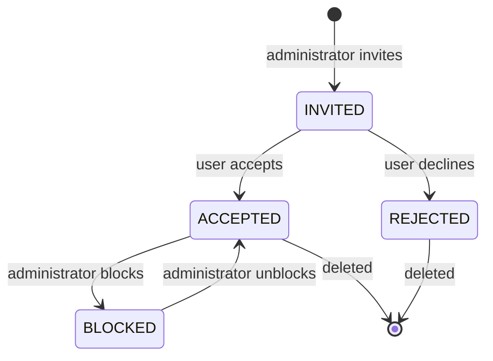

# Feature: Project Profiles

> A profile is the **unit of access**. Not the account, not the role — the profile. It says: *this user, on this
project, with this role, between these dates, in this state.* Everything a person can do inside a project flows from
> one.

**Who this is for:** administrators granting access, and every user answering an invitation.

## Who can do what

| Role                        | May do                                                                                            | Limits                                       |
|-----------------------------|---------------------------------------------------------------------------------------------------|----------------------------------------------|
| `PROJECT_ADMINISTRATOR`     | Create (invite) · Read · Update · Block · Unblock · Delete · search users · list assignable roles | This project only                            |
| `PROJECT_COORDINATOR`       | Read the project's profiles                                                                       | Cannot invite, edit or remove anyone         |
| `PROJECT_PARTICIPANT`       | Nothing                                                                                           | Cannot even see who else has access          |
| Global `USER_ADMINISTRATOR` | Create a **support profile** for themselves on any project                                        | One hour, administrator-level, fully visible |
| Any authenticated user      | List **their own** profiles and invitations, accept, reject, remove their own                     | Acting on themselves only                    |

Managing access is deliberately concentrated: only the administrator invites, edits and removes. The coordinator can see
the team; the participant cannot.

## The life of a profile



Only `ACCEPTED` grants rights — and only while the access window is open. `INVITED`, `REJECTED` and `BLOCKED` grant
nothing at all.

Two profiles skip the invitation entirely and start `ACCEPTED`, because there is nobody to ask: the one created by
**creating a project**, and the **support profile**.

## You cannot grant what you do not have

Roles are ranked by level, and the rule is uniform: **you may assign your own role or a weaker one, never a stronger
one.** A coordinator inviting people could only ever create coordinators and participants — except coordinators cannot
invite at all, so in practice this bites when an administrator edits a profile.

The rule is checked twice on an edit: against the profile's **current** role, and against the **new** one. You cannot
edit a profile that already outranks you, and you cannot promote anyone past yourself.

```gherkin
Scenario: Refusing to assign a role stronger than my own
  Given my role on the project is weaker than PROJECT_ADMINISTRATOR
  When I try to grant someone the PROJECT_ADMINISTRATOR role
  Then the request is denied

Scenario: Refusing to edit a profile that outranks me
  Given a profile holds a role stronger than mine
  When I try to change it
  Then the request is denied

Scenario: Listing the roles I may assign
  When I ask for the assignable roles on this project
  Then I get my own role and every weaker one
```

## Access windows, and why two profiles cannot overlap

A profile may carry a start and an end. Outside that window it grants nothing — enforced continuously, not merely at
sign-in, so access granted "for the weekend" ends by itself on Monday.

Because of that, **one user may not hold two profiles on the same project whose windows overlap**. Two live profiles
would make "your role here" ambiguous. Non-overlapping profiles are fine: a coordinator in June, an administrator in
July.

```gherkin
Scenario: Refusing an overlapping profile
  Given a user already holds a profile on this project for next week
  When I invite them again for an overlapping period
  Then that user is skipped

Scenario: Losing access when the window closes
  Given my profile's access window has closed
  When I try to read the project
  Then the request is denied
```

## Inviting several people at once

Invitations are sent in bulk, and the result is **partial by design**. Users whose window would overlap an existing
profile are skipped rather than failing the whole request, and the response reports both lists: who was invited, and who
was not.

```gherkin
Scenario: Inviting a mixed batch
  Given one of the five users I selected already has an overlapping profile
  When I send the invitations
  Then four profiles are created
  And the response names the user who was skipped
```

Searching for users to invite returns a **capped** list of visible accounts matched by fuzzy text — it is a picker, not
a directory export.

## Answering an invitation

An invitation is yours to answer, and yours alone. Only a profile in `INVITED` state can be answered, and only with
`ACCEPTED` or `REJECTED` — no other status can be set this way.

```gherkin
Scenario: Accepting an invitation
  Given I hold an INVITED profile on a project
  When I accept it
  Then the profile becomes ACCEPTED
  And I gain that project's permissions for my role

Scenario: Rejecting an invitation
  Given I hold an INVITED profile
  When I reject it
  Then the profile becomes REJECTED and grants nothing

Scenario: Refusing to answer twice
  Given I already accepted an invitation
  When I try to answer it again
  Then the request is rejected
```

## Blocking, removing, and the protected administrator

Blocking hides a profile and cuts its rights while keeping it on the list — the reversible way to suspend someone.
Removing deletes it.

One rule guards both, plus editing: **a project's last administrator cannot be blocked, edited out of the role, or
removed.** Registry refuses to leave a project without an owner, naming the project in the error so you know which one
is blocking you.

```gherkin
Scenario: Blocking a profile
  Given a member of the project
  When its administrator blocks their profile
  Then they lose all access while the profile stays listed

Scenario: Refusing to block the last administrator
  Given a project with a single administrator
  When I try to block that profile
  Then the request is rejected and the project is named

Scenario: Refusing to demote the last administrator
  Given a project with a single administrator
  When I try to change that profile's role
  Then the request is rejected
```

## Support profiles

A global `USER_ADMINISTRATOR` can grant themselves a profile on **any** project without being invited. It is not a back
door — it is a real profile:

- administrator-level, `ACCEPTED` immediately;
- valid for exactly **one hour** from creation;
- listed among the project's profiles like anyone else's;
- subject to the same overlap rule, so it is refused if the administrator already has a live profile there;
- it becomes their selected profile if they had none, dropping them straight into the project.

::: tip There is no invisible super-user
If a platform administrator looked inside a project, there is a profile in that
project saying so, with a one-hour window attached.
:::

```gherkin
Scenario: Creating a support profile
  Given I am a global USER_ADMINISTRATOR with no profile on this project
  When I create a support profile on it
  Then I hold an accepted administrator profile valid for one hour
  And it is listed among the project's profiles

Scenario: Support access expiring
  Given my support profile was created more than an hour ago
  When I try to read the project
  Then the request is denied
```

## Related

- [Roles & Permissions](/registry/functional/roles-and-permissions) — the level model and how rights are computed
- [Preferences](/registry/functional/features/preferences) — selecting which profile you are working through
- [Users](/registry/functional/features/users) — the global plane
