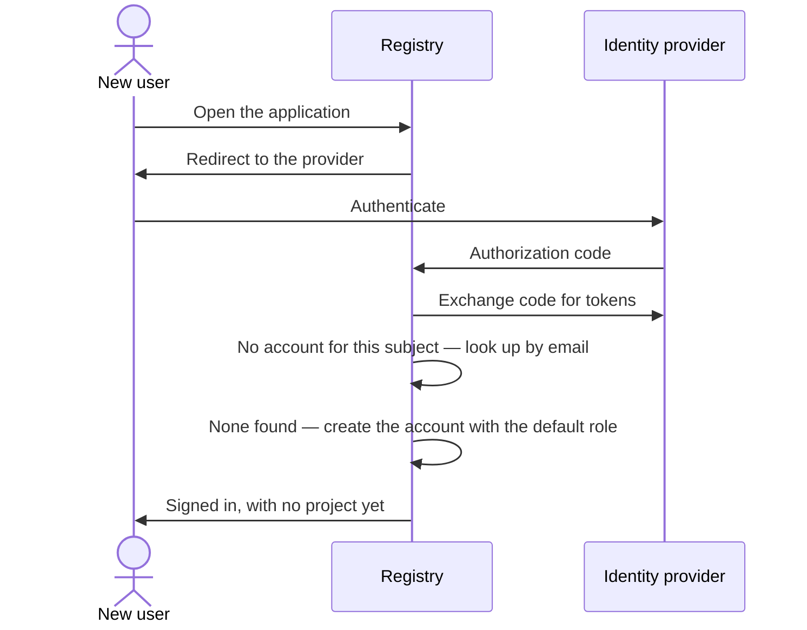
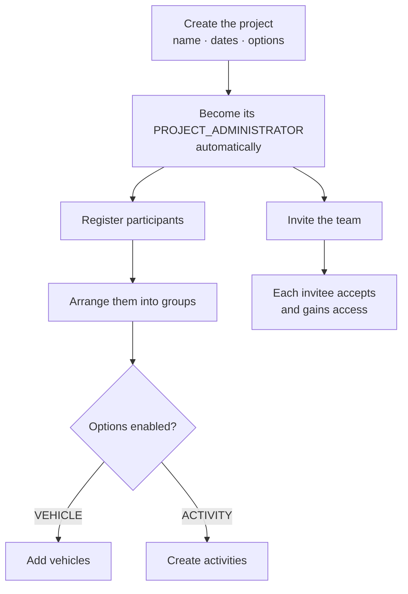
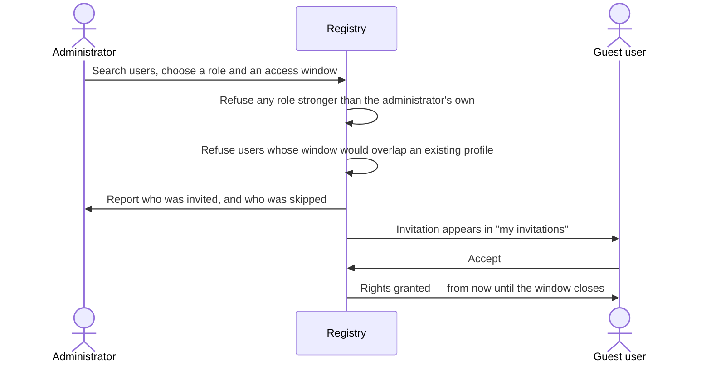
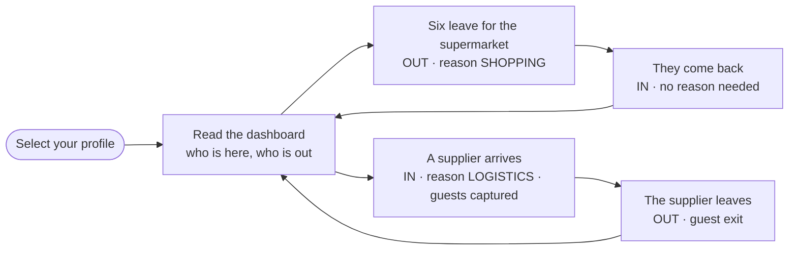
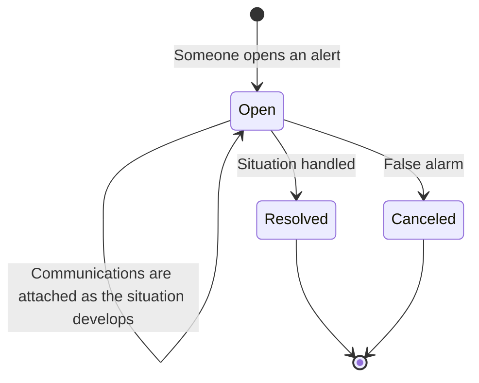
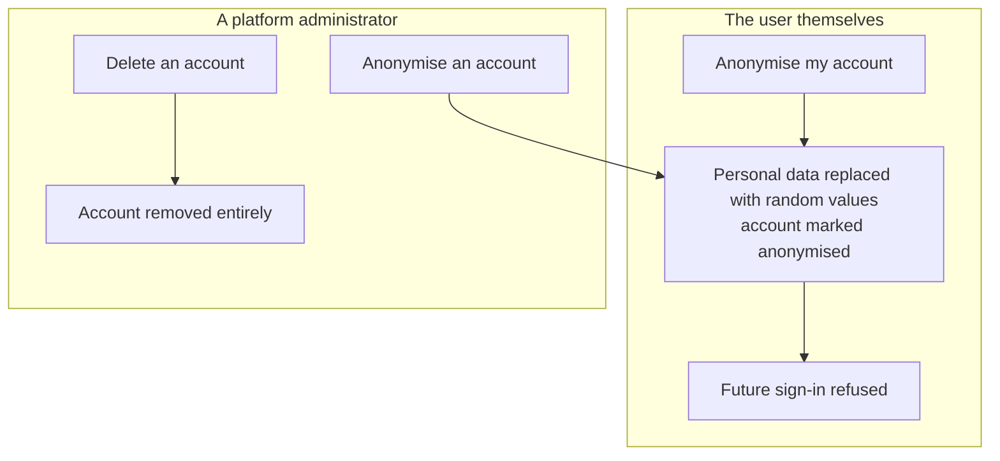

# Workflows

Feature pages describe rules. This page describes **journeys** — the sequences people actually live through, and the order in which the rules bite.

## 1. Signing in for the first time

Nobody creates your account. You sign in, and it appears.

You land with the global `USER` role, which grants exactly one meaningful thing: **you may create a project.**

Three things can stop you at the door: your account has been blocked, your account has been anonymised, or two accounts already share your email address. In each case sign-in is refused rather than guessed at.

## 2. Standing up a project

The organiser's journey, done once, well before anyone arrives.

Three things are worth knowing before you start:

- **Creating a project makes you its administrator**, through a real profile that appears in the profile list like any other. There is no implicit ownership.
- **Options have dependencies.** `COMMUNICATION` needs `ACTIVITY`; `ALERT` needs both. Asking for alerts alone is refused, with the missing options named.
- **The project's dates constrain everything.** Every participant window, group window, movement, communication and alert must fall inside them — which is why narrowing the dates later is refused if anything would fall outside.

## 3. Getting someone onto a project

Access is always a two-party act: an administrator offers, the user accepts.

Two behaviours regularly surprise people:

- **Inviting several users at once is partial by design.** Users who already have an overlapping profile are silently skipped, and the response reports both lists. The invitation is not rejected wholesale because one person was already there.
- **An invitation grants nothing until accepted**, and access ends by itself when the window closes. Nobody has to remember to revoke it.

## 4. A day on the gate

The loop that the product exists for.

The **selected profile** is the pivot of the whole session: it decides which project you are operating on. Without one, the movement and configuration screens refuse to open and tell you to pick a project first.

Once you are in, the loop is: read the dashboard, record what happens, watch the dashboard change. Presence is recomputed from the movement log on every read, so the counters are never stale and never need reconciling.

::: tip Correcting a mistake
Recorded a movement in the wrong direction? You cannot flip it — hide it and record it again the right way round. Hiding removes it from the presence computation and is reversible, which makes it the safe correction. Deleting is permanent and reserved to administrators and coordinators.
:::

## 5. Handling an incident

Available only when the project has the `ALERT` option — which in turn requires `COMMUNICATION` and `ACTIVITY`.

While an alert is open, anyone with a profile can add communications to it. Closing it — resolved or cancelled — **freezes it**: its content can no longer be edited and no new communication can be attached. An alert that carries communications cannot be deleted at all; the record of an incident survives the incident.

## 6. Winding a project down

There are three different endings, and they are not interchangeable.

| Ending | What happens | Who can | Reversible |
| ------ | ------------ | ------- | :--------: |
| **Disable** | The project drops out of everyone's world. Its administrator keeps only the ability to read, re-enable or delete it — everything inside becomes unreachable, even for them | Administrator | ✅ |
| **Delete** | The project and everything in it is removed permanently | Administrator | ❌ |
| **Purge** | The retention job removes projects and content untouched past the threshold | Scheduled job | ❌ |

Disabling is the graceful option: it stops the project being used without destroying anything, and it can be undone.

## 7. Leaving the platform

Two doors, and the difference matters.

Anonymisation severs the identity but keeps the account row — so the history that references it stays coherent, with nobody's name on it. Deletion removes the account outright.

Both doors are guarded by the same rule: **the last administrator cannot walk through them.** Neither the last global administrator, nor anyone who is the last administrator of a project, can be anonymised or deleted. Hand the role over first.

## 8. The nightly retention pass

Four independent sweeps, each with its own schedule and its own threshold, running in a deliberate order.

| Sweep | Removes | Default threshold |
| ----- | ------- | ----------------- |
| Users | Accounts with no sign-in since the threshold | 12 months |
| Projects | Projects untouched since the threshold | 12 months |
| Project content | Movements, communications and alerts | 12 months |
| Project configuration | Vehicles, activities, groups and participants | 12 months |

Content is purged before configuration for a reason: participants and vehicles refuse deletion while a movement still references them, so the movements have to go first.

Every sweep accepts a **dry run**, which reports exactly what would be removed and touches nothing. It is the only sensible way to run one for the first time.
