# Architecture Decision Records

These records capture the significant technical choices behind Registry, in causal order. Each states the problem it
answered, what was chosen, why, and what the choice costs.

They document the system **as it is implemented today**. Where a decision has a cost that is still being paid, the
*Consequences* section says so plainly rather than reading as a justification.

| ADR                                                                    | Title                                                     | Side     | Status   |
|------------------------------------------------------------------------|-----------------------------------------------------------|----------|----------|
| [001](/registry/technical/adr/001-hexagonal-architecture)              | Hexagonal architecture, enforced by ArchUnit              | Backend  | Accepted |
| [002](/registry/technical/adr/002-reactive-webflux-r2dbc)              | Reactive stack: WebFlux and R2DBC                         | Backend  | Accepted |
| [003](/registry/technical/adr/003-kotlin-java25)                       | Kotlin on JVM 25                                          | Backend  | Accepted |
| [004](/registry/technical/adr/004-oidc-resource-server-auth)           | OIDC resource server with backend-brokered token exchange | Both     | Accepted |
| [005](/registry/technical/adr/005-db-driven-project-rbac)              | Database-driven, project-scoped permissions               | Backend  | Accepted |
| [006](/registry/technical/adr/006-flyway-trigram-search)               | Flyway migrations and trigram search in PostgreSQL        | Backend  | Accepted |
| [007](/registry/technical/adr/007-inverted-adapter-naming)             | Adapter packages named from the domain's point of view    | Backend  | Accepted |
| [008](/registry/technical/adr/008-frontend-runtime-config)             | Frontend configuration fetched at runtime                 | Frontend | Accepted |
| [009](/registry/technical/adr/009-ngxs-state-management)               | NGXS with per-domain facades                              | Frontend | Accepted |
| [010](/registry/technical/adr/010-container-delivery-semantic-release) | Container delivery with Semantic Release                  | Both     | Accepted |
| [011](/registry/technical/adr/011-scheduled-retention-purges)          | Retention purges as scheduled, permission-gated endpoints | Backend  | Accepted |
| [012](/registry/technical/adr/012-primeng-runtime-theming)             | PrimeNG with runtime theming                              | Frontend | Accepted |

## How they fit together

```mermaid
flowchart TD
    A001["001 Hexagonal<br/>+ ArchUnit"] --> A002["002 Reactive<br/>WebFlux + R2DBC"]
    A001 --> A007["007 Adapter naming"]
    A002 --> A003["003 Kotlin / JVM 25"]
    A002 --> A006["006 Flyway + pg_trgm"]
    A001 --> A004["004 OIDC resource server"]
    A004 --> A005["005 Project-scoped RBAC"]
    A005 --> A006
    A005 --> A011["011 Retention purges"]
    A010["010 Immutable images<br/>+ Semantic Release"] --> A008["008 Runtime config"]
    A008 --> A012["012 PrimeNG theming"]
    A009["009 NGXS facades"] --> A012
    A004 --> A008
```



Two chains run through the set. On the backend, the hexagonal decision makes the reactive and persistence choices
tractable, and the authentication decision leads directly to the permission model, which in turn shapes the schema and
the retention jobs. On the frontend, the immutable-image requirement forces runtime configuration, which is what makes
runtime theming possible at all.

## ADR format

```markdown
# ADR NNN — Title

## Status

Accepted | Proposed | Superseded by ADR XXX

## Context

The problem or requirement that forced a decision.

## Decision

What was chosen, concretely.

## Rationale & best practices

Why — with security, performance and maintainability called out where relevant.

## Consequences

- **Pros:** what this buys.
- **Cons / trade-offs:** what it costs, stated honestly.
- **Alternatives rejected:** what else was viable, and why it lost.
```

New records take the next free number and are added to the table above and to the sidebar. A decision that replaces an
earlier one does not edit it — it gets its own record, and the superseded one's status is updated to point at it.
