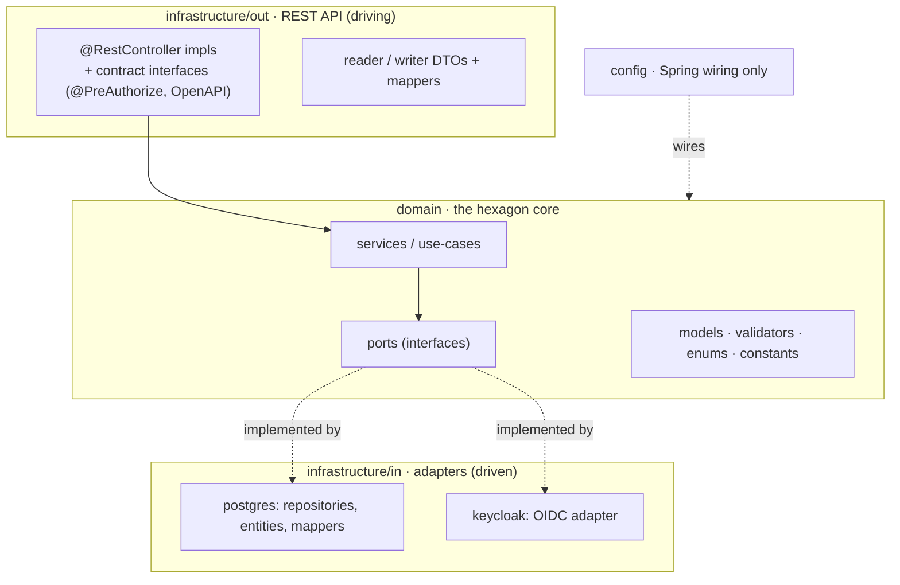
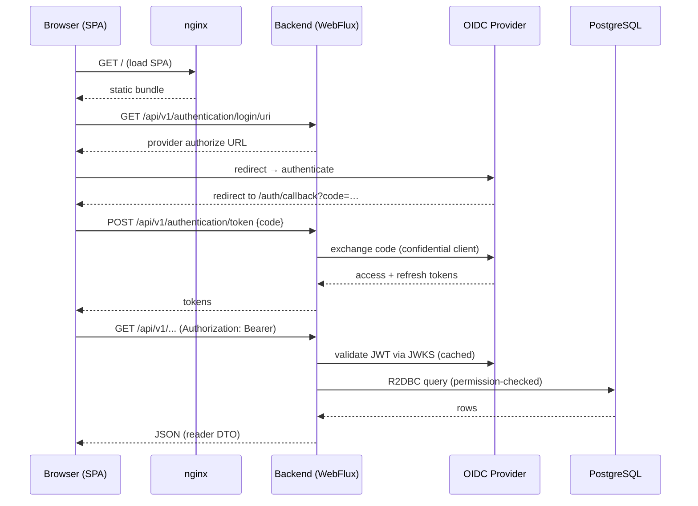

# Architecture

Registry is two deployables — a reactive Kotlin backend and an Angular SPA — talking over a versioned REST API, with an external OIDC provider and a single PostgreSQL database behind the backend. This page describes each service's internal shape and how a request flows end to end.

## Backend — hexagonal, reactive

The backend follows **Hexagonal architecture (ports & adapters)**. The domain sits at the centre and knows nothing about HTTP, the database, or the identity provider; everything framework-specific is an adapter at the edge. The dependency rules are not a convention — they are **verified at build time by an ArchUnit test** ([ADR 001](/registry/technical/adr/001-hexagonal-architecture)).

### Layers

- **`domain/`** — the core: `model/` (business models, `RegistryException`, pagination), `port/` (driven-port interfaces the domain depends on), `service/` + `service/impl/` (use-cases), plus `validator/`, `annotation/`, `enumeration/`, `constant/`, `handler/` and reactive `extension/` helpers. No Spring-web or persistence types leak in.
- **`infrastructure/out/`** — the **REST API** (the outward-facing, "driving" side). Controllers are **contract-first**: REST semantics — path mapping, `@PreAuthorize`, OpenAPI tags, bean validation, `@AuthenticationPrincipal CurrentUserModel` — live on an interface (`I…V1Controller`); the `@RestController` impl only delegates to a domain service. Inbound *writer* DTOs and outbound *reader* DTOs are mapped to/from domain models.
- **`infrastructure/in/`** — the **driven adapters** that feed the domain: `postgres/` (R2DBC repositories implementing the domain ports, entities, entity mappers) and `keycloak/` (the OIDC provider adapter).
- **`config/`** — Spring wiring only (`SecurityConfig`, `R2dbcConfig`, `I18nConfig`, `GsonConfig`, `SwaggerConfig`, `LoggerConfig`).

> **Naming caveat.** This codebase inverts the textbook hexagonal labels: `infrastructure/in` is the persistence/identity side ("data coming in") and `infrastructure/out` is the REST API ("facing out"). This is the opposite of the usual "inbound = REST" convention — mind the inversion when reading the package tree.

### Reactive from top to bottom

Every layer is non-blocking: WebFlux controllers return `Mono`/`Flux`, repositories use the reactive **R2DBC** driver, and writes run inside reactive transactions (`TransactionalOperator`) with programmatic R2DBC auditing. Schema management is the one exception — **Flyway** migrates the database over a JDBC connection on boot, so the backend opens two connections to the same database: an R2DBC pool for runtime and JDBC for migrations ([ADR 002](/registry/technical/adr/002-reactive-webflux-r2dbc)). Repositories hand-write SQL via Spring Data `@Query`, composing reusable fragments (join clauses, visibility/project filters) to stay DRY, and assemble `PageModel` results from a count + a page query.

### Cross-cutting concerns

- **Errors** — a `RegistryControllerAdvice` maps `RegistryException`, validation failures, and framework exceptions to a localized `ErrorDto` (status, code, i18n title/message).
- **Validation** — Jakarta Bean Validation plus a family of custom cross-field constraints (`@StartBeforeEnd`, `@MinUpperMax`, `@MovementReason`, `@BothCannotBeDefined`, `@AtLeastOneIsDefined`, `@MovementGuestContent`, `@DateDefinedForTime`, `@ProjectOptionDependencies`, `@ProfileAcceptOrReject`), evaluated by a reflection-based `GenericValidator`.
- **i18n** — request locale from the `Accept-Language` header drives `messages`/`errors` bundles (English default, French supported).
- **Pagination** — the API takes `pageNumber` (≥ 0, default 0) and `pageSize` (bounded 1–200, default 20), mapped to the domain's `PageableModel(offset, limit)`; a `PageModel` (content + page metadata) comes back, assembled from a count query plus a page query.
- **Observability** — Spring Actuator with a Micrometer/Prometheus endpoint, feature-flagged per environment.

## Frontend — standalone Angular, per-route state

The frontend is a **standalone-component Angular 22 SPA** (no `NgModule`), organized by domain.

- **Bootstrap & runtime config.** Before the app bootstraps, `AppConfig.load()` fetches two JSON files — `settings/config.json` (theme tokens, logos, enabled UI actions, languages, notification durations) and `settings/env.json` (backend URL, production flag, no-auth paths). The repo ships only placeholders; the real files are injected per environment, so one built image serves any environment ([ADR 007](/registry/technical/adr/007-frontend-runtime-config)).
- **Folder taxonomy.** `domains/project/**` and `domains/user/**` hold the feature domains, each with its own `data/` (NGXS state, DTOs, models). `shell/` holds the app frame (navbar, auth-callback). `shared/util-*` libraries provide UI components, models/enums, the central state, tools, config, and authentication.
- **State management.** NGXS (`@State`/`@Action`/`@Selector`) exposed to components as **Signals** through facade classes. Feature state is **provided per route** — scoped to the lazy-loaded subtree and code-split with it — while a root state holds the current user, preferences (theme, language), and cross-cutting UI (notifications, online status, screen width) ([ADR 008](/registry/technical/adr/008-ngxs-state-management)). The "active project" is simply `currentUser.preferences.selectedProfile.project`; selecting a profile updates preferences server-side and resets dependent feature states.
- **HTTP & auth.** A functional interceptor attaches the bearer token, substitutes URL placeholders (current user id, selected project id), refreshes the token on `401`, and normalizes transport errors into user-facing notifications.
- **Routing & guards.** Lazy `loadChildren` for `projects` and `users` behind an `authGuard`; nested guards enforce that a profile is selected (`selectedProfileGuard`) and that the project has the relevant option enabled — one guard per gated module (`vehicle-option`, `activity-option`, `activity-communication-option`, `activity-alert-option`; the last two also assert the option's dependency chain) — mirroring the backend's per-project option authorities.

## Request flow, end to end

The [Security](/registry/technical/security) page details the JWT-to-user mapping and how the project-scoped permission check happens on every call.

## Deployment topology

Four cooperating tiers:

1. **PostgreSQL** — the single source of truth; schema owned by Flyway.
2. **OIDC provider** — issues and signs JWTs; configured generically (see [ADR 004](/registry/technical/adr/004-oidc-resource-server-auth)).
3. **Backend** — distroless Java 25 image, non-root, listening on **two** ports: `:8081` serves `/api/v1/**` and
   nothing else, while `:8082` carries health probes, Prometheus metrics and (optionally) OpenAPI. Only the first
   belongs on a public ingress ([ADR 014](/registry/technical/adr/014-separate-management-port)). CORS is restricted
   to a configured allowlist.
4. **Frontend** — the static bundle served by an unprivileged nginx on `:8080` with SPA fallback and hardening headers; parameterized per environment by the two runtime JSON files.

Both services are versioned by semantic-release and published as container images with a retain-5 policy ([ADR 009](/registry/technical/adr/009-container-delivery-semantic-release)).
