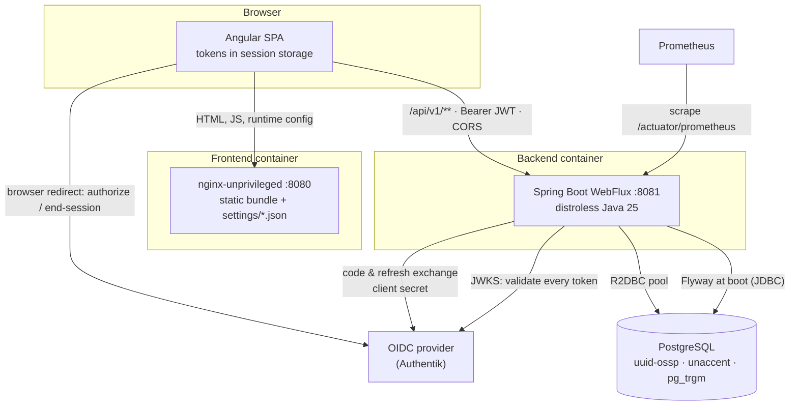
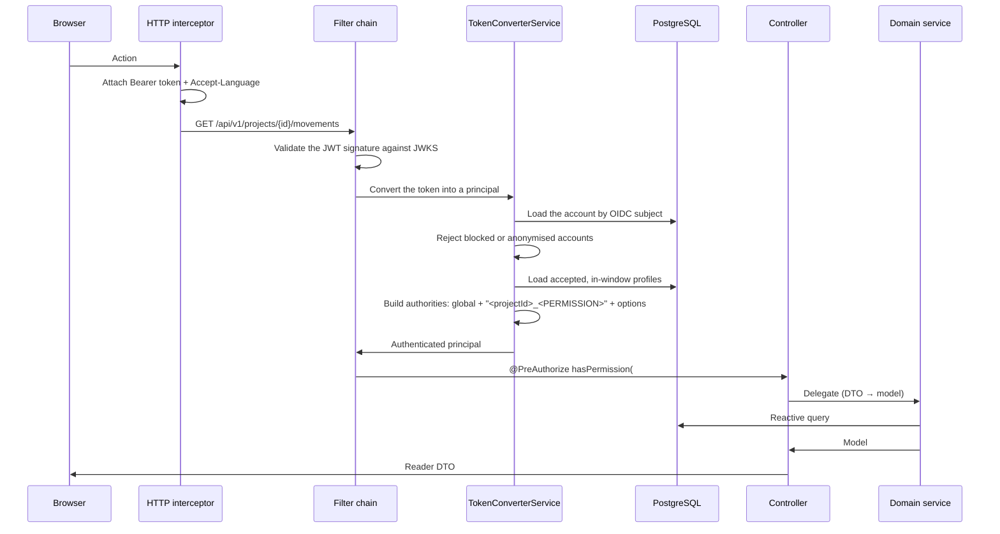
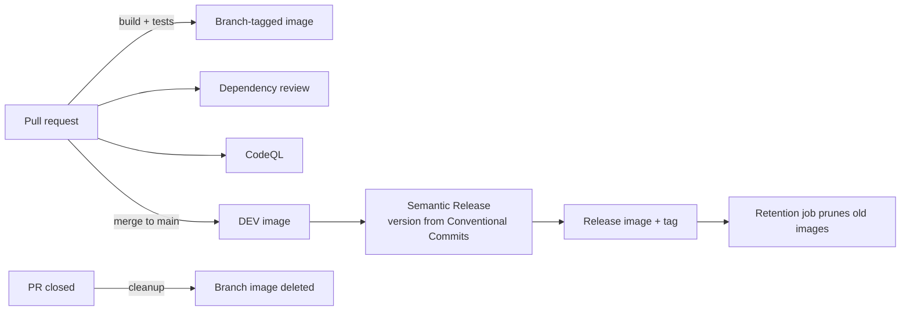

# Architecture

Registry is two independently built, independently released applications that meet at one REST contract. Neither shares code with the other; the API is the seam.

## Deployment topology

Three details in that picture are load-bearing:

- **The browser never calls the identity provider's token endpoint.** It is redirected to the provider to authenticate, gets an authorization code back, and hands that code to the *backend*, which performs the exchange. The OIDC client secret therefore lives only on the server — the SPA is not a confidential client.
- **The frontend is a static bundle.** nginx serves files; it proxies nothing. The browser talks to the API directly, cross-origin, which is why CORS is a first-class concern on the backend.
- **The database is reached two ways.** R2DBC for all runtime access, and plain JDBC once at boot for the Flyway migration run — Flyway has no reactive driver.

## Runtime request flow

An authenticated call carries a JWT, and every request rebuilds the caller's rights from scratch:

The interesting move is in `TokenConverterService`: project permissions become **authority strings prefixed with the project's identifier**, like `9f3c…_REGISTRY_PROJECT_MOVEMENT_R`. A permission check is then a string comparison against the authority set, and multi-tenant isolation is structural — an authority for one project simply cannot satisfy a check for another. See [Security](/registry/technical/security).

The cost is equally structural: every request pays a couple of database reads to rebuild the principal, and a token stays valid until it expires even if a profile was revoked a minute ago.

## The two sides

| | Backend | Frontend |
| --- | --- | --- |
| Repository | `Registry-Backend` | `Registry-Frontend` |
| Runtime | JVM 25, distroless image, port 8081 | nginx-unprivileged, port 8080 |
| Shape | Hexagonal, enforced by ArchUnit | Feature-first domains, NGXS state |
| Configuration | JVM options and environment variables | `settings/config.json` and `settings/env.json`, fetched at boot |
| Detail | [Backend](/registry/technical/backend) | [Frontend](/registry/technical/frontend) |

### Where each concern lives

| Concern | Owner | Note |
| ------- | ----- | ---- |
| Authentication | **Backend** | Builds the provider URLs and brokers both token exchanges |
| Authorisation | **Backend** | `@PreAuthorize` on every endpoint; the frontend only mirrors it for the UI |
| Multi-tenant isolation | **Backend** | Project-prefixed authorities, checked per endpoint |
| Business rules | **Backend** | Validation annotations plus domain-service chains |
| Presentation, theming, i18n copy | **Frontend** | Runtime-configurable per environment |
| Route guards | **Frontend** | Convenience only — never a security boundary |
| Retention purges | **Backend** | Cron-driven, permission-gated endpoints |

::: warning The frontend enforces nothing
Route guards and hidden buttons are usability, not security. Every rule they express is independently enforced by the backend, which assumes the client is hostile.
:::

## Delivery

Both sides follow the same pipeline, and both release **one immutable image per version**:

Versions are **derived from commit messages**, never hand-edited, which is why Conventional Commits are mandatory in both repositories. A `*-hotfix-*` tag branched off a release tag builds an isolated image outside the Semantic Release flow.

Because the image is immutable, **nothing environment-specific may be baked into it**. The backend takes its configuration from JVM options and environment variables; the frontend fetches two JSON files at boot. That single constraint explains [ADR 008](/registry/technical/adr/008-frontend-runtime-config).

## Observability

The backend exposes Micrometer metrics on `/actuator/prometheus`, with request-latency histograms enabled, behind a feature flag that also decides whether the actuator endpoints are publicly reachable. springdoc publishes OpenAPI and Swagger UI behind a second flag, off by default and intended for development only.

The frontend has no telemetry of its own.

## Related

- [Backend](/registry/technical/backend) · [Frontend](/registry/technical/frontend)
- [Security](/registry/technical/security) — the authority model in full
- [Data Model](/registry/technical/data-model) — schema and migrations
- [ADR index](/registry/technical/adr/) — why each of these choices was made
