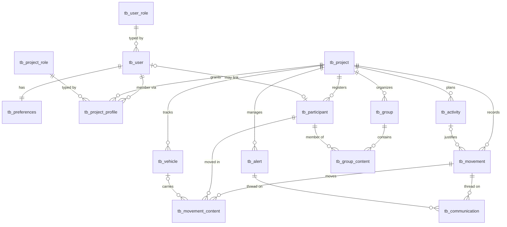

# Data Model

Registry stores everything in a single PostgreSQL database. The schema is owned by **Flyway migrations** (`V1_0_0` through `V1_12_0`), applied on boot; runtime access is reactive **R2DBC**. This page is the physical-schema companion to the business-facing [Domain Model](/registry/functional/domain-model).

## Entity-relationship overview

Every table except `tb_user`, `tb_preferences` and the RBAC tables carries a `project_id` foreign key — **the project is the tenant boundary**, and most foreign keys to a project cascade on delete.

## Conventions

- **Primary keys** are UUIDs.
- **Auditing.** Every domain table has `created_date`, `created_by`, `last_modified_date`, `last_modified_by` (the `*_by` columns reference `tb_user`), populated by R2DBC auditing.
- **Soft delete / disable.** A `visible BOOLEAN` column implements the reversible "disable/enable" seen across the product. Disabling never deletes a row; it flips `visible`, which the authority model reads for [visibility gating](/registry/technical/security#visibility-gating).
- **Split date/time.** Windows and event times are stored as separate `_date DATE` and `_time TIME WITH TIME ZONE` columns (the domain models them as `CustomDateTime`), so a value can be date-only.
- **Trigram search.** Searchable tables carry a `STORED GENERATED search_text` column with a GIN `gin_trgm_ops` index — see [below](#search).

## Tables

### Identity & preferences

| Table | Key columns | Notes |
| ----- | ----------- | ----- |
| `tb_user` | `oidc_id` (unique), `type` (`USER`/`SERVICE_ACCOUNT`), `first_name`, `last_name`, `email` (unique), `role` → `tb_user_role`, `birthday`, `last_login`, `purged`, `visible` | Global identity. `purged` marks anonymized accounts; `visible=false` means blocked. A partial unique index enforces a single `SERVICE_ACCOUNT`. `search_text` = name + email. |
| `tb_preferences` | `user_id` (unique) → `tb_user` (cascade), `selected_profile_id` → `tb_project_profile` (set null), `theme`, `language` | One row per user; holds the active profile selection and UI preferences. |

### Project & membership

| Table | Key columns | Notes |
| ----- | ----------- | ----- |
| `tb_project` | `name`, `begin_date`/`begin_time`, `end_date`/`end_time`, `options TEXT[]` | The tenant root. `options` lists enabled modules (`VEHICLE`, `ACTIVITY`, `COMMUNICATION`, `ALERT`). |
| `tb_project_profile` | `user_id` → `tb_user` (cascade), `project_id` → `tb_project` (cascade), `role` → `tb_project_role` (cascade), `status`, `start_access_*`/`end_access_*` | A user's membership: role, invitation `status` (`INVITED`/`ACCEPTED`/`REJECTED`/`BLOCKED`), and access window. |

### Participants & groups

| Table | Key columns | Notes |
| ----- | ----------- | ----- |
| `tb_participant` | `first_name`, `last_name`, `birthday` (not null), `type` (`REGISTERED`/`GUEST`), `user_id` → `tb_user` (set null), `project_id` (cascade), `start/end_availability_*`, `purged` | A person in the event, optionally linked to a user. `search_text` = name. Presence status is derived from movements, not stored. |
| `tb_group` | `name`, `project_id` (cascade), `start/end_availability_*` | A named set of participants. |
| `tb_group_content` | PK (`group_id`, `participant_id`), both cascade | Group ↔ participant many-to-many. |

### Movements (core)

| Table | Key columns | Notes |
| ----- | ----------- | ----- |
| `tb_movement` | `date_time`, `type` (`IN`/`OUT`), `project_id` (cascade), `activity_id` → `tb_activity`, `reason` | A check-in/out event, justified by either a `reason` or an `activity_id` (never both). |
| `tb_movement_content` | PK (`movement_id`, `participant_id`), `pool_name` (nullable `VARCHAR`), `vehicle_id` → `tb_vehicle` | The people moved. `pool_name` is the name of the group expanded to produce this entry, snapshotted at record time; it is `NULL` for a participant added individually, and is independent of `vehicle_id`. |

### Optional modules

| Table | Key columns | Notes |
| ----- | ----------- | ----- |
| `tb_vehicle` | `license_plate`, `brand`, `model`, `project_id` (cascade), `start/end_availability_*` | `search_text` = plate + brand + model. Presence derived from movements. |
| `tb_activity` | `name`, `description`, `duration`, `min_allowed_participants`, `max_allowed_participants`, `project_id` (cascade), `start/end_availability_*` | Usable as a movement reason. `search_text` = name + description. |
| `tb_communication` | `date_time`, `message`, `movement_id` → `tb_movement` (cascade, nullable), `alert_id` → `tb_alert` (set null), `project_id` (cascade) | A message attached to a movement and/or an alert (at least one). |
| `tb_alert` | `date_time`, `title`, `status` (`IN_PROGRESS`/`RESOLVED`/`CANCELED`), `project_id` (cascade) | An incident with its own communication thread. |

### RBAC (roles & permissions as data)

Two parallel sets of three tables encode the [two permission planes](/registry/functional/roles-and-permissions#two-permission-planes):

| Global plane | Project plane | Purpose |
| ------------ | ------------- | ------- |
| `tb_user_permission (name)` | `tb_project_permission (name)` | The catalog of permission names. |
| `tb_user_role (name, level)` | `tb_project_role (name, level)` | Roles, with a numeric `level` (lower = more powerful). A partial unique index forces exactly one level-0 role. |
| `tb_user_role_permission (role, permission)` | `tb_project_role_permission (role, permission)` | The role → permission mapping. |

These rows are seeded by the `_roles` migrations and loaded into memory at startup; changing them is a data operation (and a restart) rather than a code change ([ADR 005](/registry/technical/adr/005-db-driven-project-rbac)).

## Search

`V1_4_0` adds fuzzy search without a separate search engine ([ADR 006](/registry/technical/adr/006-flyway-trigram-search)):

- the `pg_trgm` extension is enabled;
- `tb_user`, `tb_participant`, `tb_vehicle` and `tb_activity` each gain a `STORED GENERATED` `search_text` column concatenating their human-identifying fields;
- each `search_text` gets a **GIN `gin_trgm_ops`** index for fast substring/fuzzy matching.

Result-set sizes are bounded by configuration to keep search cheap.

## Migration history

| Migration | Adds |
| --------- | ---- |
| `V1_0_0` / `V1_0_1` | Initial structure; base user roles |
| `V1_1_0` / `V1_1_1` | Groups; group roles |
| `V1_2_0` / `V1_2_1` | Vehicles; vehicle roles |
| `V1_3_0` / `V1_3_1` | Activities; activity roles |
| `V1_4_0` | Trigram search columns and indexes |
| `V1_5_0` | Movement reason |
| `V1_6_0` | Guest participant type |
| `V1_7_0` / `V1_7_1` | Communication structure; communication roles |
| `V1_8_0` / `V1_8_1` | Alert structure; alert roles |
| `V1_9_0` | Scheduled-job (purge) role |
| `V1_10_0` | Preferences improvements |
| `V1_11_0` | Remove service-account email |
| `V1_12_0` | Fix activity indexes (moved from `tb_vehicle` to `tb_activity`) |

> Migrations are forward-only. New schema changes are added as a new `V…` file, never by editing an applied migration.
