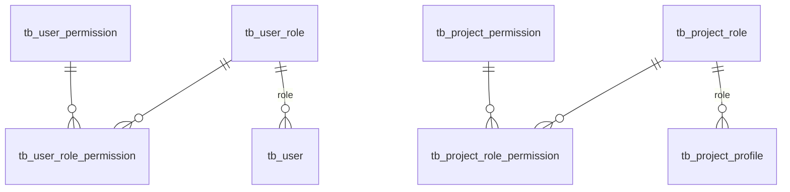

# Data Model

PostgreSQL, reached over R2DBC at runtime and over JDBC once at boot for migrations. Three extensions are required:
`uuid-ossp` for identifier generation, `unaccent`, and `pg_trgm` for fuzzy search.

## Conventions

Every table follows the same shape, which is why the schema reads consistently:

| Convention      | Detail                                                                                                                                       |
|-----------------|----------------------------------------------------------------------------------------------------------------------------------------------|
| Naming          | `tb_<entity>`, snake_case columns                                                                                                            |
| Primary key     | `uuid`, defaulted to `uuid_generate_v4()`                                                                                                    |
| Audit columns   | `created_date`, `created_by`, `last_modified_date`, `last_modified_by` — the two `_by` columns reference `tb_user` with `ON DELETE SET NULL` |
| Soft delete     | `visible boolean NOT NULL DEFAULT TRUE`                                                                                                      |
| Tenancy         | `project_id` on every project-owned table, `ON DELETE CASCADE`                                                                               |
| Enums           | Stored as `VARCHAR`, not PostgreSQL enum types — adding a value needs no migration                                                           |
| Dates and times | Split into a `_date` and a `_time with time zone` column, both nullable                                                                      |

::: tip Why dates and times are separate columns
An availability window can be a **date without a time** — "available
from the 3rd" — which a single timestamp cannot express without inventing a time. The split lets the queries default a
missing time to `00:00` on the start side and `23:59:59.999999` on the end side, which is exactly the intended
semantics. The cost is that every range comparison is a two-part expression.
:::

## The schema

### Access control

Six tables, and they hold **data that behaves like code**:



`tb_user_role` and `tb_project_role` each carry a `level`, with a **partial unique index** enforcing that at most one
row per plane has `level = 0`:

```sql
CREATE UNIQUE INDEX tb_user_role_level0 ON tb_user_role (level) WHERE level = 0;
```

That single index is what makes "the one most powerful role" a schema guarantee rather than a convention.

### Identity

| Table                | Notes                                                                                                                                                                                                           |
|----------------------|-----------------------------------------------------------------------------------------------------------------------------------------------------------------------------------------------------------------|
| `tb_user`            | `oidc_id` and `email` are **uniquely indexed**; `type` is `USER` or `SERVICE_ACCOUNT`, with a partial unique index allowing exactly one service account; `purged` marks anonymisation; `visible` marks blocking |
| `tb_preferences`     | One row per user (unique index on `user_id`), holding `theme`, `language` and `selected_profile_id`                                                                                                             |
| `tb_project_profile` | The access unit: `user_id`, `project_id`, `role`, `status`, and the access window                                                                                                                               |

### The project's world

| Table                           | Notes                                                                                                  |
|---------------------------------|--------------------------------------------------------------------------------------------------------|
| `tb_project`                    | `options TEXT[] NOT NULL DEFAULT '{}'` — the enabled options as a Postgres array                       |
| `tb_participant`                | `type` is `REGISTERED` or `GUEST`; `user_id` is nullable and `ON DELETE SET NULL`; availability window |
| `tb_group` + `tb_group_content` | Membership is a composite primary key on `(group_id, participant_id)`                                  |
| `tb_vehicle`                    | Plate, brand, model, availability window                                                               |
| `tb_activity`                   | Description up to 2000 chars, `duration`, `min_allowed_participants`, `max_allowed_participants`       |

### The record

| Table                 | Notes                                                                                                                |
|-----------------------|----------------------------------------------------------------------------------------------------------------------|
| `tb_movement`         | `date_time`, `type`, an optional `reason`, an optional `activity_id`                                                 |
| `tb_movement_content` | Composite primary key `(movement_id, participant_id)`, plus `vehicle_id` and `pool_name`                             |
| `tb_communication`    | `movement_id` **and** `alert_id`, both nullable since V1_8_0 — at least one is required, enforced in the application |
| `tb_alert`            | `title`, `status`, `date_time`                                                                                       |

::: warning `pool_name` is a copied group name, not a reference
`tb_movement_content.pool_name` is free text with no foreign key. The frontend writes the **group's name** onto every
line when a group is selected, so the movement snapshots the group as it was. Nothing in the database ties it back to
`tb_group`, and nothing validates that the participant is a member — deliberately, so that later membership changes
cannot rewrite history. See [Movements](/registry/functional/features/movements#moving-a-whole-group-at-once).
:::

## Search

`V1_4_0` added a **generated, stored `search_text` column** to the four searchable tables, each with a GIN trigram
index:

| Table            | Concatenates                   |
|------------------|--------------------------------|
| `tb_user`        | first name · last name · email |
| `tb_participant` | first name · last name         |
| `tb_vehicle`     | licence plate · brand · model  |
| `tb_activity`    | name · description             |

Queries then filter on `similarity(search_text, :textSearched) > 0` and sort by that score, which gives typo-tolerant
search without a separate index server. Because the column is `GENERATED ALWAYS … STORED`, it can never drift from its
source fields.

## Derived reads

Two computations are pushed entirely into SQL rather than assembled in the application.

**Presence** comes from a `last_movement` CTE — the most recent **visible** movement per participant — and reduces to:

```sql
last_movement
.
type
IS NULL OR last_movement.type = 'OUT'   -- → absent
```

**Availability** is a two-part range comparison per side, with a twist: a participant's own dates fall back to the
aggregate of their visible groups before falling back to a sentinel.

```sql
COALESCE(t.start_availability_date, fg.min_start_availability::DATE, '+infinity'::DATE) < CURRENT_DATE
```

The sentinel choice is the rule: `+infinity` on the start side and `-infinity` on the end side mean an element with **no
dates and no group** is treated as **unavailable**. Availability is opt-in.

## Indexing

Every foreign key is indexed — `project_id` for tenant filtering, `created_by` and `last_modified_by` so the audit
`SET NULL` cascades stay cheap — plus the four GIN trigram indexes and the uniqueness constraints noted above.

## Migrations

Flyway, `src/main/resources/db/migrations`, versioned `V<major>_<minor>_<patch>__<description>.sql`, applied at boot
over JDBC. They are **forward-only**: an applied migration is never edited.

| Migration | Brings                                                                                             |
|-----------|----------------------------------------------------------------------------------------------------|
| `V1_0_0`  | Users, preferences, projects, profiles, participants, movements, and the six access-control tables |
| `V1_0_1`  | The seed: global and project permissions, the five roles, and their mappings                       |
| `V1_1_x`  | Groups, group content, `pool_name` on movement content, group permissions                          |
| `V1_2_x`  | Vehicles, `vehicle_id` on movement content, vehicle permissions                                    |
| `V1_3_x`  | Activities, `activity_id` on movements, activity permissions                                       |
| `V1_4_0`  | `pg_trgm` and the four generated `search_text` columns                                             |
| `V1_5_0`  | `reason` on movements                                                                              |
| `V1_6_0`  | `type` on participants — guests                                                                    |
| `V1_7_x`  | Communications and their permissions                                                               |
| `V1_8_x`  | Alerts; `alert_id` on communications; `movement_id` made nullable                                  |
| `V1_9_0`  | The `REGISTRY_JOB_C` permission for the retention jobs                                             |
| `V1_10_0` | `theme` and `language` on preferences                                                              |
| `V1_11_0` | Clears the service account's email                                                                 |
| `V1_12_0` | Corrects `tb_activity`'s indexes, which `V1_3_0` created on `tb_vehicle` by mistake                |

::: tip `V1_12_0` is the pattern to copy
`V1_3_0` created the activity indexes on the wrong table. Because migrations are forward-only, the fix drops the
misplaced indexes and creates the intended ones **in a new migration**, with a comment explaining why — rather than
editing history and desynchronising every environment that already ran it.
:::

The feature migrations show the house style: a `_0` migration for the structure, a `_1` migration seeding the
permissions that structure needs. New features follow the same pairing.

## Related

- [Backend](/registry/technical/backend) — the R2DBC and repository layer above this schema
- [Security](/registry/technical/security) — how the access-control tables become authorities
- [ADR 006](/registry/technical/adr/006-flyway-trigram-search) · [ADR 005](/registry/technical/adr/005-db-driven-project-rbac)
