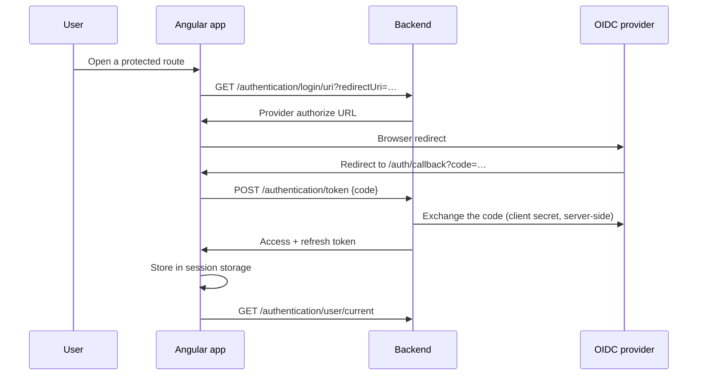

# Frontend

`Registry-Frontend` — an Angular single-page application, served as static files and configured at runtime. It holds the
session, mirrors the backend's authorisation for the sake of the UI, and enforces nothing.

## Stack

| Concern         | Choice                                                                       |
|-----------------|------------------------------------------------------------------------------|
| Framework       | Angular 22, standalone components, no NgModules                              |
| Language        | TypeScript 6, `no-explicit-any` and explicit return types as errors          |
| UI              | PrimeNG 22 with `@primeuix/themes` (Lara preset), Bootstrap grid, PrimeIcons |
| State           | NGXS 22, one store per feature area, Redux devtools outside production       |
| i18n            | `@ngx-translate` with the HTTP loader, `en` and `fr`                         |
| Package manager | pnpm 11                                                                      |
| Lint            | ESLint with angular-eslint                                                   |
| Serving         | nginx-unprivileged, port 8080                                                |

Style conventions: 4-space indent, single quotes, spaces inside array and object brackets.

## Application shape

```
src/app/
  domains/
    project/            The project world
      project-home/       dashboard, current movements, activities, alerts
      movement/           list, form, content field, communications
      alert/              list, communications
      communication/      shared data layer
      configuration/      project-profile · participant · group · vehicle · activity
      data/               project + selected-project state
    user/               users, profiles, invitations, settings
  shell/                navbar, auth callback, shell state
  shared/
    util-ui/            reusable presentation components
    util-authentication/ guards, HTTP interceptor, security service
    util-config/        runtime config models, NGXS error handler
    util-model/         DTOs, models, enums
    util-common/        the root Registry state
    util-tool/          pipes, directives, storage and generic helpers
```

Each domain folder holds its feature components plus a `data/` folder containing the NGXS pieces (`*.state.ts`,
`*.action.ts`, `*.facade.ts`, `*.service.ts`), its view models, and its routing (`<domain>.routes.ts` +
`<domain>-routes.enum.ts`).

### Routing

Two lazy top-level areas — `projects` and `users` — both behind `authGuard`, with a catch-all redirecting to `projects`.
Only `auth/callback` is reachable unauthenticated.

Routes nest three deep, and each level **provides its own facades and feature states** rather than registering them
globally, so a store only exists while the screens that need it are mounted:

```
/projects                         list
/projects/create
/projects/:projectId/edit
/projects/selected                dashboard
/projects/movements               + /:id/edit          [selectedProfileGuard]
/projects/alerts                                       [selectedProfileGuard, alertOptionGuard]
/projects/configuration/profiles      …/:id/edit       [selectedProfileGuard]
/projects/configuration/participants  …/edit · /movements
/projects/configuration/groups        …/edit · /members
/projects/configuration/vehicles      …                [vehicleOptionGuard]
/projects/configuration/activities    …                [activityOptionGuard]
/users · /users/:userId/edit · /users/profiles · /users/invitations · /users/settings
```

### Guards

| Guard                                                           | Checks                                                                                                    |
|-----------------------------------------------------------------|-----------------------------------------------------------------------------------------------------------|
| `authGuard`                                                     | Restores the session from storage and fetches the current user; every protected route waits on it         |
| `selectedProfileGuard`                                          | A profile is selected. If not, it raises a toast telling the user to pick a project and blocks navigation |
| `vehicleOptionGuard`, `activityOptionGuard`, `alertOptionGuard` | The selected project carries the corresponding option                                                     |

::: warning Guards are usability, not security
Every one of these conditions is re-checked by the backend on every
request. A user who bypasses a guard reaches an endpoint that refuses them. Guards exist so the UI does not offer dead
ends.
:::

## State: component → facade → action → state → service

NGXS is used with a strict one-way flow, and the **facade is the only thing components talk to**:

```
Component  →  Facade  →  dispatch(Action)  →  @Action handler in State  →  Service (HTTP)
                ↑                                      │
                └────────── selectors / signals ───────┘
```

Components stay thin: no HTTP, no business logic, no state mutation outside an `@Action` handler. The root
`RegistryState` owns everything cross-cutting — the token, the current user, the selected project, theme, network
status, screen width, the global loader, the global error, and the notification queue — and each feature area adds its
own state alongside it.

Performance conventions: lazy-loaded routes, `OnPush` change detection, the async pipe over manual subscriptions,
`takeUntilDestroyed()` where a subscription is unavoidable, `@for` with `track`, server-side pagination for every list,
and debounced search inputs.

## Authentication in the browser

The backend brokers the OIDC exchanges; the frontend orchestrates the redirects and holds the result.



### The HTTP interceptor

One interceptor handles everything that touches the backend, and ignores every other host:

- attaches the `Bearer` token and the user's `Accept-Language`;
- on **401**, refreshes the token once and replays the original request — transparently to the caller. With no token at
  all, it starts the login flow instead;
- on **0 / 502 / 503**, converts the failure into a translated "service unavailable" error, which the NGXS error handler
  surfaces as a full-page state rather than a toast;
- everything else becomes a typed `ErrorModel`, turned into a sticky error toast.

Tokens live in **session storage**, so they are per-tab and cleared when the tab closes.

## Runtime configuration

The image is immutable, so nothing environment-specific is compiled in. At boot the application fetches two files from
`settings/`, cache-busted, before Angular bootstraps:

**`env.json`** — where the backend is:

```json
{
  "production": true,
  "backend": {
    "url": "https://api.example.org",
    "noAuthPaths": [
      "/api/v1/authentication/login/uri",
      "/api/v1/authentication/logout/uri",
      "/api/v1/authentication/token",
      "/api/v1/authentication/token/refresh"
    ]
  }
}
```

**`config.json`** — how it looks and behaves: the default language and the supported list, a full PrimeNG theme preset
(semantic palette, light and dark colour schemes, component overrides), logo paths per theme and size, the enabled
element actions, and per-severity notification durations.

Both are mounted into the nginx container per environment. A missing or malformed file is logged and the application
continues with whatever loaded — startup is not blocked.

::: tip Theming is data, not code
The entire PrimeNG preset lives in `config.json`, so re-skinning a deployment means
replacing a JSON file, not rebuilding the bundle. Light and dark palettes are defined separately, with dark mode
selected by a `.dark-mod` class.
:::

## Accessibility and UX conventions

Accessibility is treated as a review criterion rather than a backlog item: semantic HTML first, keyboard operability
throughout with visible focus, labels or accessible names on every control, state changes announced through PrimeNG's
message and toast components, WCAG AA contrast in both themes, and `prefers-reduced-motion` respected.

The UX rules that recur in review: every action gives feedback — loading indicator, disabled state while in flight,
success or error toast, an empty state — no user-facing string is hardcoded outside `@ngx-translate`, and new reusable
UI belongs in `shared/util-ui` rather than being reinvented per screen.

## Build and delivery

```bash
pnpm install
pnpm start                              # ng serve, needs the backend running
pnpm run build                          # add --configuration=production
pnpm run lint
```

The production build enables output hashing and enforces bundle budgets — an initial bundle over 500 kB or a component
stylesheet over 2 kB raises a warning. The Docker image copies `dist/browser` into `nginx-unprivileged`, whose config
serves the SPA with `try_files … /index.html`, gzips text assets, and sets a small hardening header set:
`X-Frame-Options: SAMEORIGIN`, HSTS with preload, `X-Content-Type-Options: nosniff`,
`X-Permitted-Cross-Domain-Policies`, `X-Download-Options`, `X-XSS-Protection`, and `server_tokens off`.

::: warning No Content-Security-Policy
The nginx configuration sets no CSP header. It is the most valuable header
missing from the set.
:::

## Testing

Unit tests are **not configured**: `skipTests` is on in the Angular schematics, there is no runner and no `test` script.
`pnpm run lint` is the only automated gate in the repository, alongside the CI workflows. Quality currently rests on the
backend's test suite and on the separate `Registry-E2E` project.

## Related

- [Architecture](/registry/technical/architecture) — how the two sides meet
- [Security](/registry/technical/security) — what the frontend does and does not enforce
- [Getting Started](/registry/technical/getting-started) — running it locally
