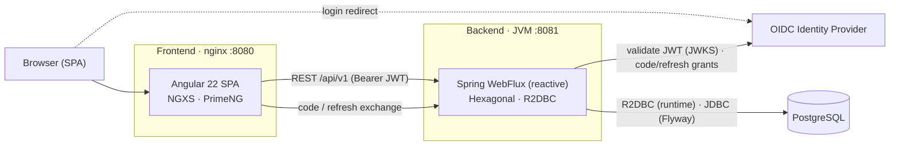

# Technical Documentation

This section covers the engineering of Registry: the two-service architecture, the reactive backend, the Angular frontend, the data model and API contracts, the security model, and the Architecture Decision Records that justify each choice. It assumes the [Functional Documentation](../functional/) — especially the [Roles & Permissions](../functional/roles-and-permissions) baseline — is understood.

## System at a glance

Registry is delivered as **two independently versioned services** plus two supporting infrastructure components:



The browser loads the SPA from nginx, which calls the backend over REST with a bearer JWT. Authentication is delegated to an external OIDC provider; the backend both validates JWTs (as a resource server) and brokers the code/refresh exchanges (as a confidential client). All state lives in a single PostgreSQL database.

## Documentation map

| Page | Purpose |
| ---- | ------- |
| [Getting Started](./getting-started) | Run the whole stack locally: prerequisites, dependencies, and configuration |
| [Architecture](./architecture) | The hexagonal backend, the Angular frontend, and how a request flows end to end |
| [Security](./security) | Authentication flow, JWT-to-user mapping, and how the project-scoped RBAC is enforced |
| [Data Model](./data-model) | The PostgreSQL schema, entity relationships, auditing, and trigram search |
| [API Reference](./api-reference) | Every REST endpoint, grouped by domain, with its required permission |
| [ADR index](./adr/) | All Architecture Decision Records, in causal order |

## Stack summary

| Layer | Backend                                             | Frontend |
| ----- |-----------------------------------------------------| -------- |
| Language | Kotlin 2.x (JVM toolchain 25)                       | TypeScript 6 |
| Framework | Spring Boot 4.1 · WebFlux (reactive)                | Angular 22 (standalone) |
| Architecture | Hexagonal (ports & adapters), ArchUnit-enforced     | Domain-driven folders, per-route lazy state |
| State / data | R2DBC (reactive) + Flyway migrations                | NGXS (`selectSignal`), facade pattern |
| UI | —                                                   | PrimeNG (Lara) + PrimeIcons |
| Auth | OAuth2 resource server + confidential client (OIDC) | OIDC redirect flow, token interceptor |
| API docs | springdoc OpenAPI (feature-flagged)                 | — |
| i18n | messages/errors bundles (en, fr)                    | `@ngx-translate` (en, fr) |
| Observability | Actuator + Micrometer/Prometheus                    | — |
| Build | Gradle (Kotlin DSL)                                 | Angular CLI + pnpm |
| Runtime image | Distroless Java 25, non-root, JVM jar               | Unprivileged nginx serving the static bundle |
| Persistence | PostgreSQL (`pg_trgm` trigram search)               | — |
| Release | semantic-release → GHCR (retain 5)                  | semantic-release → GHCR (retain 5) |

## ADR format

Each ADR lives in `adr/[NNN]-[short-title].md` and follows this structure:

```markdown
# ADR NNN — Title

## Status

Accepted | Superseded by ADR NNN | Deprecated

## Context

What problem or constraint triggered this decision?

## Decision

What was decided?

## Consequences

Positive and negative trade-offs, and why the alternatives were rejected.
```
