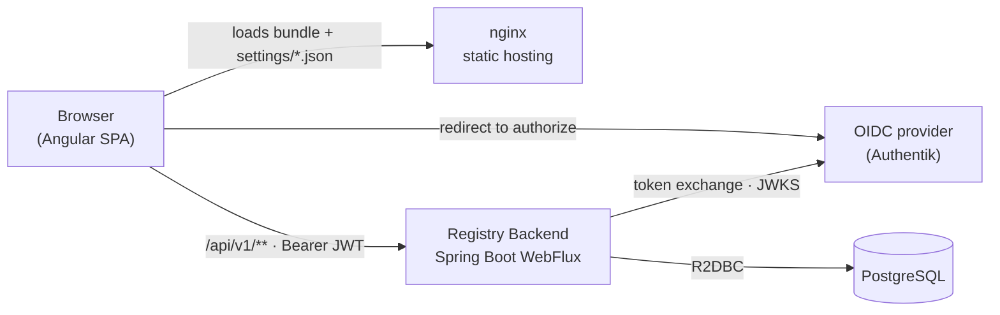

# Technical Documentation

This section covers the engineering of Registry: a reactive Kotlin backend, an Angular single-page frontend, and the decision records behind each choice. It assumes the [Functional Documentation](/registry/functional/) — in particular the roles and permissions baseline — is understood.

::: info Documents what is deployed
Everything in this section describes the system **as it is implemented today**. Where the code and its own inline documentation disagree, the code wins and the divergence is called out.
:::

## Two sides, one contract

Registry is delivered as two independently built and released container images that meet at a versioned REST contract.

The browser never calls the identity provider's token endpoint itself: the backend owns the OIDC client secret and brokers the code and refresh exchanges. The frontend holds the resulting tokens and sends them as `Bearer` credentials on every API call.

## Stack summary

| Concern | Backend | Frontend |
| ------- | ------- | -------- |
| Language | Kotlin 2.4 on JVM 25 | TypeScript 6 |
| Framework | Spring Boot 4.1 WebFlux (fully reactive) | Angular 22, standalone components |
| Build | Gradle (Kotlin DSL) | Angular CLI + pnpm |
| Persistence | R2DBC + PostgreSQL, Flyway migrations | — |
| State | — | NGXS 22 with per-domain facades |
| UI | — | PrimeNG 22 + `@primeuix/themes` + Bootstrap grid |
| Auth | OAuth2 resource server (JWT), permission-based `@PreAuthorize` | Token in session storage, HTTP interceptor, route guards |
| i18n | Spring `MessageSource` (`en`, `fr`) | `@ngx-translate` (`en`, `fr`) |
| Observability | Micrometer → Prometheus, springdoc OpenAPI | — |
| Packaging | Distroless Java 25 image | nginx-unprivileged image |
| Quality gates | Kover coverage, ArchUnit rules, JUnit 5 + Testcontainers | ESLint (angular-eslint) |

## Where to go next

The technical documentation is completed in the following pages: getting started, the system architecture, one page per side, the data model, the API reference, the security model, and the Architecture Decision Records. They are listed in the sidebar as they are published.
