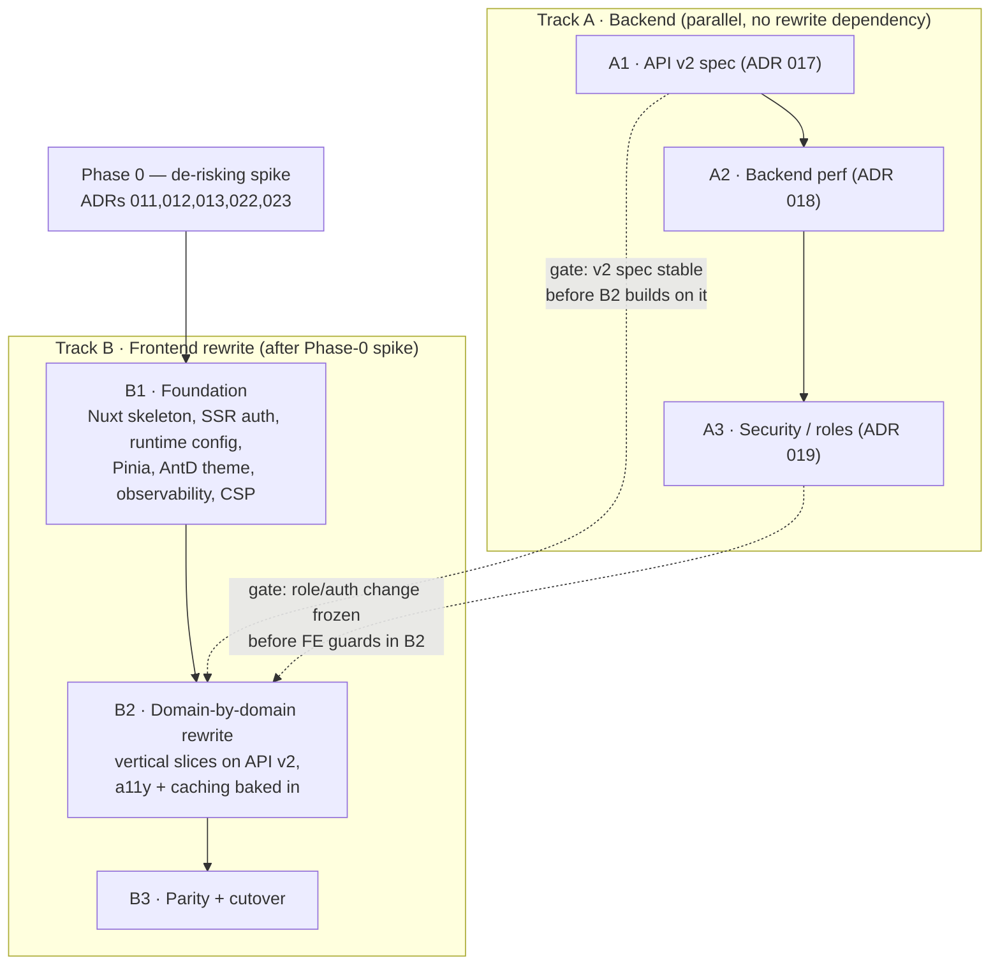

# Migration Plan

This page defines the spec-driven migration of Registry: a ground-up **Vue 3 + Nuxt (SSR)** frontend rewrite with **Ant Design Vue**, alongside independent backend tracks for **API v2**, performance, and security hardening. It is a planning artifact — the source of truth for *what specs to write, in what order, and behind which gates*. Each change below is realized as a spec (functional where behaviour changes, then an ADR) **before** any implementation, per the repository's functional-first-then-technical workflow.

> **Working agreement — validate each pattern before propagating.** During implementation, every distinct pattern (a component built on Ant Design Vue, a Pinia store/facade, a cached query, an SSR-auth route, a v2 endpoint, a test shape) is implemented **once** as a reference instance, presented for validation, and only **then** replicated across the codebase. The first vertical slice of each ADR is that checkpoint.

## Guiding principles

1. **The REST contract is the seam.** Backend and frontend are independently deployable, so the backend tracks run **in parallel** with the frontend rewrite, and the new frontend is born consuming **API v2**.
2. **Spec-first gating.** Functional / security baseline first, then technical ADRs, then code. Nothing in `technical/` is drafted before its functional and roles baseline is settled.
3. **The rewrite window is used once.** Accessibility, the design system, SSR, and data-caching are **baked into the rewrite specs**, never retrofitted onto the Angular app.
4. **De-risk early.** The rewrite is committed (ADRs 011/012/013/014/022/023 Accepted); a Phase-0 spike still runs first to de-risk the hard mechanics (SSR + OIDC auth, Ant Design Vue under SSR, Nuxt runtime config) before broad implementation.

## Settled decisions

| Decision | Choice |
| -------- | ------ |
| Frontend framework | **Vue 3 + Nuxt** — full rewrite (committed); Phase-0 spike de-risks early |
| Rendering | **Full SSR** — reworks the auth model ([ADR 004](/registry/technical/adr/004-oidc-resource-server-auth)); de-risked in the spike |
| Design system | **Ant Design Vue** (replaces PrimeNG; PrimeVue excluded — same licensing) |
| State management | **Pinia** — supersedes [ADR 009](/registry/technical/adr/009-ngxs-state-management) (NGXS) |
| Accessibility | **WCAG 2.2 AA**, as a dedicated workstream (Ant Design Vue is not headless/ARIA-first) |
| Backend | **API v2** (with v1 sunset policy), caching + DB optimization, security hardening |
| Extra scope | Frontend observability (web-vitals/RUM + errors) · Playwright e2e parity net · CSP + auth rate-limiting |
| Out of scope | OpenAPI-generated TypeScript client (considered, dropped) |

## Phase 0 — De-risking spike

A throwaway Nuxt POC that de-risks the riskiest unknowns before broad implementation. The rewrite decisions are already **Accepted**; the spike validates the hard mechanics and settles any remaining detail (notably ADR 024's CSP strictness).

| Unknown | What must be proven |
| ------- | ------------------- |
| **SSR + OIDC auth** | The confidential-client + resource-server flow ([ADR 004](/registry/technical/adr/004-oidc-resource-server-auth)) survives server rendering: httpOnly-cookie / server-session handling, token refresh, backend contract unchanged. *This is the sharpest consequence of choosing full SSR.* |
| **Ant Design Vue under SSR** | CSS-in-JS style extraction with no FOUC, theme tokens, bundle weight. |
| **Runtime config under Nuxt** | Keep "one immutable image, config injected at deploy" ([ADR 008](/registry/technical/adr/008-frontend-runtime-config)) via Nuxt `runtimeConfig`. |

**Outcome:** the spike confirms the hard mechanics (SSR auth, Ant Design Vue nonced styles / CSP, Nuxt runtime config) and may upgrade [ADR 024](/registry/technical/adr/024-frontend-security-headers)'s `style-src` to fully strict; findings feed back into the affected ADRs.

## Workstreams & spec artifacts

### Track A — Backend (independent; can start immediately)

| # | Change | Functional spec | Technical spec |
| - | ------ | --------------- | -------------- |
| A1 | Endpoint naming + **API v2** | Touch `roles-and-permissions` only if semantics change | **ADR 017** — v2 versioning, naming conventions, **v1 sunset policy**; rewrite [API Reference](/registry/technical/api-reference) for v2 |
| A2 | Performance: caching, DB optimization | — | **[ADR 018](/registry/technical/adr/018-backend-caching-db)** — Caffeine in-process cache (reference data only), ETag/Cache-Control, indexing + count-cost + N+1 review |
| A3 | Backend security: **rate limiting**, session/token policy, **audit logging**, private backend, CI scanning | RBAC model unchanged (trusted as-is) | **[ADR 019](/registry/technical/adr/019-backend-security-hardening)** — backend hardening. **Frontend-delivery security** (CSP, cookie flags, CSRF, SSR headers) is **[ADR 024](/registry/technical/adr/024-frontend-security-headers)** — frontend track, Nuxt tier; CSP baseline committed (strict `script-src`, pragmatic `style-src`), style-src upgrade via the spike. |

### Track B — Frontend rewrite (Phase 0 de-risks first)

| # | Change | Spec artifact |
| - | ------ | ------------- |
| B-core | Framework + rendering | **ADR 011** Vue/Nuxt · **ADR 012** SSR (SPA/SSG documented & rejected) · rewrite the frontend half of [Architecture](/registry/technical/architecture) |
| B-auth | Auth under SSR | **[ADR 022](/registry/technical/adr/022-ssr-auth-bff)** — full BFF: Nuxt is the OIDC client, Spring becomes a private standalone resource server (amends [ADR 004](/registry/technical/adr/004-oidc-resource-server-auth)) · **ADR 023** (planned) — runtime config on Nuxt, revises [ADR 008](/registry/technical/adr/008-frontend-runtime-config) |
| B-state | State management | **ADR 014** Pinia — supersedes [ADR 009](/registry/technical/adr/009-ngxs-state-management) |
| B-ui | Design system | **ADR 013** Ant Design Vue |
| B-a11y | Accessibility overhaul | **ADR 015** — WCAG 2.2 AA target, keyboard-nav & focus patterns, screen-reader acceptance criteria |
| B-data | Frontend caching / dedup / perf | **Nuxt built-ins** (`useAsyncData`/`useFetch`, keyed dedup, per-domain invalidation) — folded into implementation; no dedicated ADR |
| B-obs | Observability | **ADR 020** — web-vitals/RUM + error tracking (the frontend has none today) |
| B-test | Parity net | **ADR 021** — Playwright e2e written against the **current** app, run against the new one |

## Sequencing & gates

**Two hard cross-track gates:**

1. **API v2** must be spec-stable before the frontend (B2) builds against it.
2. Any **role / auth** change (A3) must be frozen before the frontend guards are written — the frontend mirrors backend authorities.

## Cutover

A full rewrite means a **big-bang cutover per environment** (dev → staging → prod), each gated by the Playwright parity suite (ADR 021). Both services ship immutable images via semantic-release ([ADR 010](/registry/technical/adr/010-container-delivery-semantic-release)), so cut over **blue/green at the ingress / nginx layer** and keep **v1 alive under the sunset policy** (ADR 017) until the Nuxt frontend fully replaces the Angular one.

## ADR ledger

| Action | ADRs |
| ------ | ---- |
| **New** | 011 (Vue/Nuxt) · 012 (SSR) · 013 (Ant Design Vue) · 014 (Pinia) · 015 (Accessibility) · 017 (API v2 + sunset) · 018 (Backend caching/DB) · 019 (Security hardening) · 020 (FE observability) · 021 (Test & parity) · 022 (SSR auth BFF) · 023 (Runtime config on Nuxt) · 024 (Frontend-tier security) |
| **Superseded** | 009 (NGXS → Pinia, by 014) |
| **Amended / revised** | 004 amended by 022 (auth under SSR) · 008 revised by 023 (runtime config on Nuxt) |
| **Rewritten pages** | [Architecture](/registry/technical/architecture) (frontend) · [API Reference](/registry/technical/api-reference) (v2) · [Security](/registry/technical/security) · the stack-summary table in the [Technical overview](/registry/technical/) |
