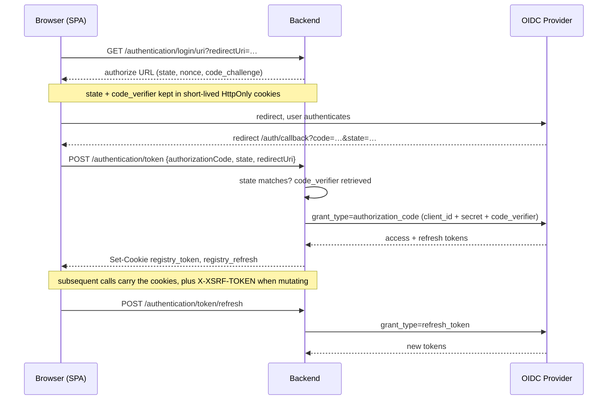
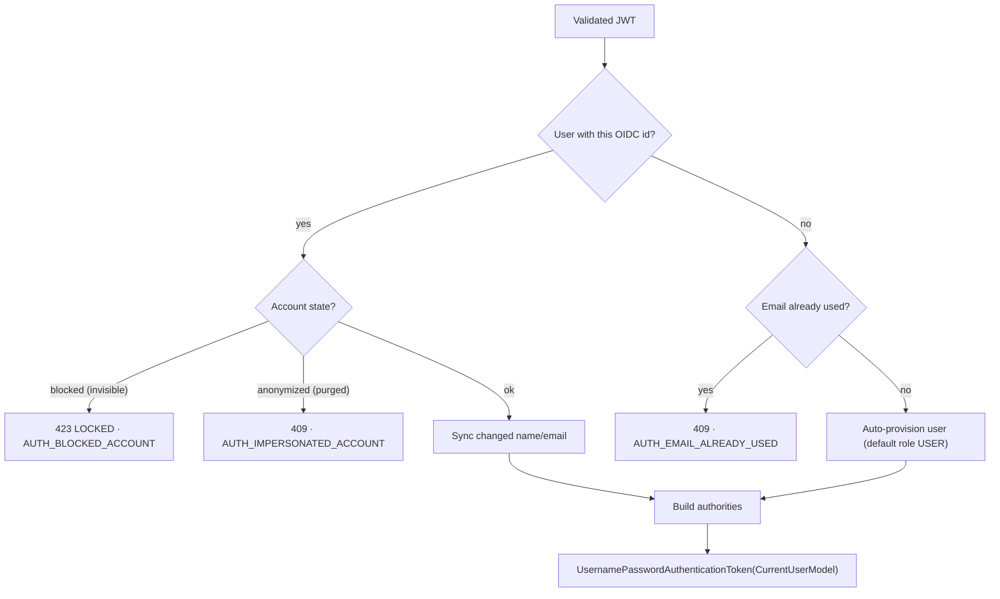

# Security

Registry delegates *authentication* to an external OIDC identity provider and enforces *authorization* itself, with a two-plane RBAC model that is stored as data and checked on every request. This page explains both halves and how they meet in the JWT-to-user conversion. The business-level roles and matrix live in [Functional → Roles & Permissions](/registry/functional/roles-and-permissions); this page is the enforcement view.

## Authentication

There is **no local password store**. The backend plays two OAuth2 roles at once:

- a **confidential client** — it brokers the authorization-code and refresh-token exchanges server-side, so the client secret never reaches the browser;
- a **resource server** — it validates the JWT on every protected call against the provider's JWKS endpoint, and
  checks that its `iss` and `aud` claims name this provider and this application. That last check matters more than
  it looks: every client of the same provider realm is signed by the same keys and published at the same JWKS
  endpoint, so without it a token minted for a *different* application would verify here perfectly well.

Only four API endpoints are public: `GET /authentication/login/uri`, `GET /authentication/logout/uri`, `POST /authentication/token`, and `POST /authentication/token/refresh`. The security chain also permits, unauthenticated, `GET /`, the Swagger UI / `api-docs` paths, and `/actuator/**` — but Swagger only serves content when `registry.feature.documentation.enabled` is set, and Actuator exposes only the Prometheus endpoint. Everything else requires a valid JWT. CORS is restricted to a configured origin allowlist (`external.cors.urls`).

### Login sequence



`state` is OAuth's CSRF token: without it, an attacker holding a valid authorization code for their own identity could
navigate a victim's browser to the callback and silently sign that victim into the attacker's account. PKCE binds the
code to the client that asked for it, which the client secret alone does not do — see
[ADR 013](/registry/technical/adr/013-cookie-session-transport).

Provider errors are normalized: a 4xx from the provider becomes `401` (code outdated), a 5xx becomes `424 FAILED_DEPENDENCY` (`AUTH_PROVIDER_FAILED`).

## JWT → application user

The custom `TokenConverterService` (registered as the JWT authentication converter) turns a validated token into the application principal, `CurrentUserModel`. It reads configurable claims (`sub` → OIDC id, plus `email`, `given_name`, `family_name`) and then:



The important behaviours: **first-time users are provisioned automatically** with the default `USER` role; **blocked and anonymized accounts are refused** at conversion time; and profile data is kept in sync with the provider on each login.

## Session transport

Both tokens are carried in cookies the backend sets, never in web storage:

| Cookie | Carries | `Path` | `SameSite` |
| ------ | ------- | ------ | ---------- |
| `registry_token` | Access token | `/` | `Lax` |
| `registry_refresh` | Refresh token | `/api/v1/authentication/token` | `Strict` |

Both are `HttpOnly` and `Secure`, so no script can read them — an XSS in the SPA or in any of its dependencies has
nothing to steal. `Domain`, `Secure` and `SameSite` are configuration (`registry.security.cookie.*`): Registry is
deployed once per tenant, with the SPA at `registry.<tenant>` and the backend at `backend.registry.<tenant>`, and local
development runs without TLS.

Because cookies are attached by the browser automatically, **CSRF protection is enabled** — double-submit, with the
token in a readable `XSRF-TOKEN` cookie echoed back as `X-XSRF-TOKEN`. Two exemptions are deliberate: requests carrying
an `Authorization` header (a caller that sets its own header is not a CSRF victim, and this is what keeps Swagger's
*try it out* working), and `POST /authentication/token`, where no session exists yet and `state` does the job instead.
`POST /authentication/token/refresh` is **not** exempt.

Token extraction reads the cookie first and falls back to the `Authorization` header, so Swagger and server-to-server
callers keep working unchanged.

::: warning Planned, not yet in effect
This section describes [ADR 013](/registry/technical/adr/013-cookie-session-transport), which is <Badge type="warning" text="Proposed" />.
The running system still carries the access token in an `Authorization` header from `sessionStorage`, and CSRF is still
disabled — correctly so, since header-based traffic is not exposed to it. This page will lose this notice when the ADR
is accepted.
:::

## Authorization — two planes, stored as data

Roles and their permissions are **rows in the database** (seeded by migrations, e.g. `V1_0_1`, `V1_1_1`), loaded into an in-memory map when the application context starts. There are two planes ([ADR 005](/registry/technical/adr/005-db-driven-project-rbac)):

- **Global** authorities — the permission names of the user's global role (e.g. `REGISTRY_PROJECT_C`, `REGISTRY_USER_R`).
- **Project-scoped** authorities — for each accepted project profile, the role's permissions are granted as **namespaced strings**: `"{projectId}_{PERMISSION}"` (e.g. `a1b2…_REGISTRY_PROJECT_MOVEMENT_C`), plus one option authority per enabled module: `"{projectId}_REGISTRY_PROJECT_OPTION_{VEHICLE|ACTIVITY|COMMUNICATION|ALERT}"`.

Because a project permission is a project-prefixed string, holding it in one event grants nothing in another — this **string-namespacing is the multi-tenant isolation mechanism**.

### Enforcement

Authorization runs through Spring method security (`@EnableReactiveMethodSecurity`) with `@PreAuthorize` on every controller contract method:

| Expression | Resolves to |
| ---------- | ----------- |
| `hasAuthority('REGISTRY_USER_R')` | a direct global-authority check |
| `hasPermission(#projectId, 'REGISTRY_PROJECT_MOVEMENT_C')` | a custom `PermissionEvaluator` that checks whether the user holds the string `"{projectId}_REGISTRY_PROJECT_MOVEMENT_C"` |

A typical project-scoped, option-gated endpoint carries both an option check and a permission check, for example:

```kotlin
@PreAuthorize(
  "hasPermission(#projectId, 'REGISTRY_PROJECT_OPTION_VEHICLE') and " +
  "hasPermission(#projectId, 'REGISTRY_PROJECT_VEHICLE_C')"
)
```

### Visibility gating

When a project is disabled (made invisible), the authority builder withholds project authorities: non-administrators get **none**, and even an administrator keeps only `REGISTRY_PROJECT_R/U/D`. Option authorities are only granted while the project is visible. A disabled event is therefore effectively frozen except for the administrator's ability to read, re-enable, or delete it.

### Authorization errors

`AuthorizationErrorHandler` renders auth failures as a JSON `ErrorDto`: `401 NOT_AUTHENTICATED` (no/invalid credentials), `401 INVALID_TOKEN`, `403 NOT_ENOUGH_PERMISSION` (access denied), and the JWT-conversion errors above. Bodies are localized via the request locale.

## Data protection

- **Anonymization ("impersonate").** Anonymizing a user scrambles their name and email, clears their birthday, and marks the account `purged`; that OIDC identity can never sign in again. A user can anonymize their own account; a platform administrator can anonymize others. This is a soft-delete for data-protection compliance, not an account-switching feature.
- **Retention purges.** The purge endpoints require `REGISTRY_JOB_C`, which the seed data grants to the
  `USER_ADMINISTRATOR` role (`V1_9_0`) — a human role, so this is not a service-account-only capability. A seeded,
  non-human user of type `SERVICE_ACCOUNT` carries that role and is what a scheduler authenticates as to purge stale
  users, projects, contents and configurations past a configurable age threshold.

  The sweeps can run **either** from calls to `/api/v1/purge/**` **or** from an in-process scheduler, which is
  opt-in through `registry.feature.purge.scheduler.enabled` and off by default. When it is on, each sweep takes a
  PostgreSQL advisory lock so that only one replica works. See
  [ADR 011](/registry/technical/adr/011-scheduled-retention-purges).

  A caller-supplied `dateThreshold` may only move the window backwards. A future threshold would make every record
  older than it and empty the table in one call, so it is rejected; a past threshold more recent than the configured
  default stays allowed, since purging more aggressively than the policy is a legitimate operational choice.
- **Last-administrator safety.** The system refuses to remove or demote the last level-0 administrator of the platform, and the last *permanent* (no end date) level-0 administrator of a project — a temporary/support profile never counts toward this safeguard.

## Safe defaults & hardening

- The backend runs as a **non-root** user in a **distroless** image.
- The frontend is served by an **unprivileged nginx** with `server_tokens off`. Security headers are set by the
  applications rather than by the web server: Spring Security's `headers` DSL for API responses, and a
  `Content-Security-Policy` declared in the Angular `index.html` for the SPA document.

  ::: warning `frame-ancestors` cannot be delivered this way
  A CSP in a `<meta>` tag ignores `frame-ancestors`, `report-uri` and `sandbox` — that is the CSP specification, not
  an oversight. The SPA therefore has no clickjacking defence of its own; the API keeps one through Spring's
  `frameOptions`. Closing the gap means either one header back in nginx, or serving the SPA from the backend so that
  everything is same-origin.
  :::
- Secrets (database credentials, OIDC client secret) are supplied through environment configuration, never baked into an image.
