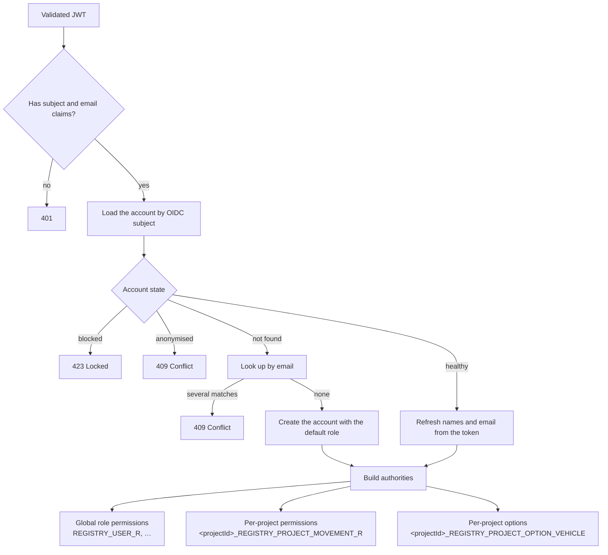

# Security

Registry's security model rests on one idea: **a permission is a string, and a project-scoped permission is that string
with the project's identifier glued to the front.** Everything else — the filter chain, the annotations, the
multi-tenant isolation — follows from it.

## The filter chain

Composed in `SecurityConfig`, in order:

| Step                                | What it does                                                                                                                                                                              |
|-------------------------------------|-------------------------------------------------------------------------------------------------------------------------------------------------------------------------------------------|
| CSRF **disabled**                   | The API is stateless and token-based. There is no cookie to forge, so there is nothing for CSRF to attack — and no session or form login may ever be reintroduced without revisiting this |
| Locale filter, registered **first** | Resolves the request locale so error messages come back translated                                                                                                                        |
| Authorisation rules                 | An explicit public allow-list; `anyExchange().authenticated()` for everything else                                                                                                        |
| Form login **disabled**             | Identity comes from the provider only                                                                                                                                                     |
| OAuth2 resource server              | Validates the JWT against the provider's JWKS, then converts it                                                                                                                           |
| Exception handling                  | 401 and 403 shaped by `AuthorizationErrorHandler`                                                                                                                                         |

### The public allow-list

Four endpoints, and only four:

```
GET  /api/*/authentication/login/uri
GET  /api/*/authentication/logout/uri
POST /api/*/authentication/token
POST /api/*/authentication/token/refresh
```

Two more groups are public **only when their feature flag is on**, and neither should be on in production: the springdoc
UI and `/api-docs/**` under `registry.feature.documentation.enabled`, and `/actuator/**` under
`registry.feature.observability.enabled`.

::: warning Actuator is unauthenticated when observability is on
`GET /actuator/**` is `permitAll` under the observability flag, so `/actuator/prometheus` is reachable by anyone who can
reach the container. The backend is expected to sit on a network where only the scraper can — that assumption is doing
real work.
:::

## From token to authorities

`TokenConverterService` turns a validated JWT into the principal. This is where the entire authorisation model is built,
on **every request**:



Only profiles that are **`ACCEPTED`** and **currently inside their access window** contribute anything — the SQL filters
on both before the authorities are built. Revoking a profile therefore takes effect on the caller's next request, not at
the next token refresh.

### Project-prefixed authorities

The mechanism is deliberately blunt. `RoleService` maps a project role to its permissions and prefixes each with the
project's UUID:

```
9f3c1a2e-…-b7d4_REGISTRY_PROJECT_MOVEMENT_R
9f3c1a2e-…-b7d4_REGISTRY_PROJECT_OPTION_VEHICLE
```

`PermissionService`, a Spring `PermissionEvaluator`, then answers `hasPermission(targetId, permission)` by testing
whether `"${targetId}_$permission"` is in the authority set. A string comparison.

::: tip Why this makes tenant isolation structural
An authority for project A **cannot** satisfy a check for project B —
the prefixes differ. Isolation is not a query filter someone might forget to apply; it is a property of the credential
itself. A missed `WHERE project_id = ?` is a bug, but it cannot be exploited into cross-tenant access without a matching
authority.
:::

### The disabled-project degradation

When a project is not visible, `RoleService` deliberately narrows what its profiles grant:

| Project role                      | Authorities granted                                              |
|-----------------------------------|------------------------------------------------------------------|
| Level 0 (`PROJECT_ADMINISTRATOR`) | Only `REGISTRY_PROJECT_R`, `_U` and `_D`, still project-prefixed |
| Any other level                   | **None at all**                                                  |

Option authorities are only granted for **visible** projects, so every option-gated feature closes too. That is exactly
enough for an administrator to re-enable or delete a wound-down project, and nothing more.

## Authorisation at the endpoint

Reactive method security is enabled, and **every endpoint carries an explicit `@PreAuthorize`**.
`anyExchange().authenticated()` is a floor, never the actual rule.

Three shapes appear:

```kotlin
// Global permission
@PreAuthorize("hasAuthority('$REGISTRY_USER_R')")

// Project-scoped permission — resolved against the projectId path variable
@PreAuthorize("hasPermission(#projectId, '$REGISTRY_PROJECT_PARTICIPANT_R')")

// Option gate AND operation permission
@PreAuthorize(
	"hasPermission(#projectId, '$REGISTRY_PROJECT_OPTION_VEHICLE') && " +
			"hasPermission(#projectId, '$REGISTRY_PROJECT_VEHICLE_R')"
)
```

The option gate is itself an authority check, which is why an option that is off closes the feature for every role
including the project's administrator.

A handful of endpoints intentionally carry **no** `@PreAuthorize`, because they act only on the caller: listing your own
projects and profiles, answering your own invitation, anonymising yourself, and setting your own preferences. They are
still authenticated, and they scope every query by the principal's own identifier.

::: warning Never add an endpoint without an explicit rule
The ArchUnit rule forcing every `@RestController` to
implement a contract interface exists partly for this: the annotation lives on the interface, where it is visible next
to the OpenAPI documentation and cannot be quietly omitted.
:::

### Permissions are data

Roles, permissions and their mappings live in six tables and are loaded into memory once, at application start, by a
`ContextRefreshedEvent` listener. Granting a role a new permission is a **Flyway migration**, not a code change.

The trade-off is worth naming: because the maps are cached at boot, a permission change applied to a running instance is
not picked up until it restarts.

## Defences at the boundary

### CORS

The frontend is a separate origin, so CORS is load-bearing rather than incidental. Origins come from
`external.cors.urls` — an explicit list, never `*` — with `allowCredentials = true`, a fixed method list, and a fixed
header allow-list (`Authorization`, `Cache-Control`, `Content-Type`, `Accept-Language` and the access-control headers).

### Input validation

Every request parameter and body is validated before it reaches the domain: Jakarta Bean Validation on the DTOs, custom
domain constraints for the cross-field rules, and `@Min` / `@Max` on pagination so an unbounded page can never be
requested. Text search goes through parameterised R2DBC queries — no string concatenation into SQL.

### Error handling

`AuthorizationErrorHandler` shapes 401 and 403; `RegistryControllerAdvice` shapes everything else. Responses carry an
i18n message key and nothing more — no stack traces, no internal messages, no entity internals. Tokens, credentials and
PII are never logged; sign-in refusals log the account identifier, not the token.

### Security headers

| Tier                 | Headers                                                                                                                                                                                   |
|----------------------|-------------------------------------------------------------------------------------------------------------------------------------------------------------------------------------------|
| **Backend**          | Spring Security's reactive defaults — `X-Content-Type-Options`, `X-Frame-Options`, `Cache-Control` on secured responses, HSTS on HTTPS                                                    |
| **Frontend (nginx)** | `X-Frame-Options: SAMEORIGIN`, HSTS with `preload`, `X-Content-Type-Options: nosniff`, `X-Permitted-Cross-Domain-Policies`, `X-Download-Options`, `X-XSS-Protection`, `server_tokens off` |

::: warning No Content-Security-Policy on either tier
Neither the backend nor the nginx configuration emits a CSP
header. For an SPA that renders user-supplied text — participant names, communication messages, alert titles — CSP is
the most valuable header currently absent.
:::

## Session handling in the browser

The frontend holds the access and refresh tokens in **session storage**: per-tab, cleared when the tab closes, and not
sent automatically with any request — the interceptor attaches them deliberately, and only to the configured backend
origin.

Session storage is readable by any script running on the page, which is the standard trade-off for a token-bearing SPA
and the reason the missing CSP matters. On a 401 the interceptor refreshes once and replays the request; with no token
at all it restarts the login flow.

## What the frontend does *not* do

Route guards mirror the backend's rules — is there a session, is a profile selected, does the project carry this
option — purely so the UI does not offer dead ends. **None of them is a security boundary.** Every condition is
re-checked server-side, and a user who defeats a guard reaches an endpoint that refuses them.

## Data protection

| Mechanism                         | Effect                                                                                                                                                      |
|-----------------------------------|-------------------------------------------------------------------------------------------------------------------------------------------------------------|
| **Anonymisation**                 | Names and email replaced with random values, birthday cleared, account flagged, future sign-in refused. The row survives so authored history stays coherent |
| **Blocking**                      | Sign-in refused while the account and its data remain intact                                                                                                |
| **Retention purges**              | Four nightly sweeps remove dormant accounts, projects, content and configuration; dry run is the default                                                    |
| **Self-service erasure**          | Any user can anonymise their own account without a permission                                                                                               |
| **Last-administrator protection** | Guards every destructive path on both planes                                                                                                                |

## Supply chain

Both repositories run **CodeQL** static analysis on pull requests, pushes to `main` and on a schedule, plus **Dependency
Review** to block a pull request that introduces a vulnerable dependency, with Dependabot keeping dependencies current.
The backend ships on a **distroless** image running as a non-root user; the frontend on **nginx-unprivileged**.

## Related

- [Roles & Permissions](/registry/functional/roles-and-permissions) — the functional matrix these mechanisms enforce
- [ADR 004](/registry/technical/adr/004-oidc-resource-server-auth) · [ADR 005](/registry/technical/adr/005-db-driven-project-rbac)
- [API Reference](/registry/technical/api-reference) — the permission required by each endpoint
