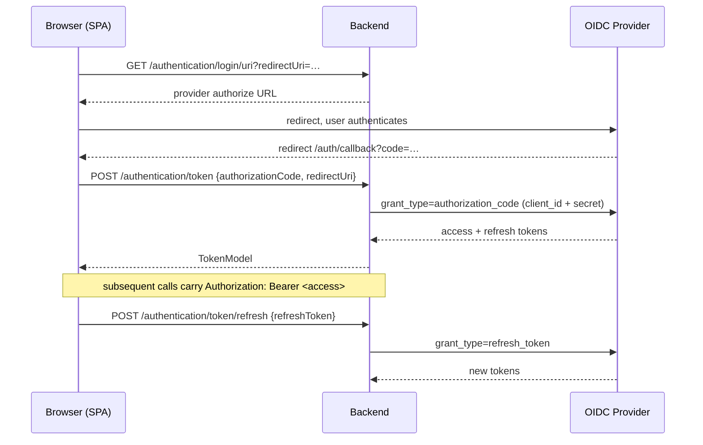
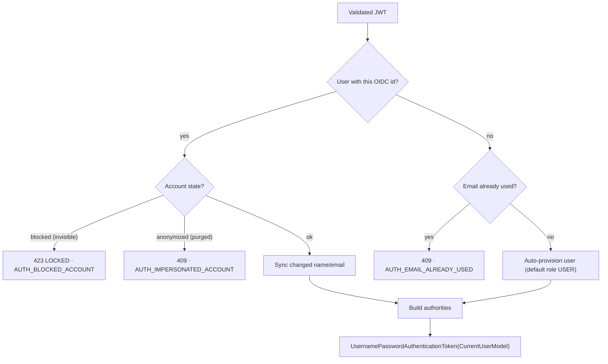

# Security

Registry delegates *authentication* to an external OIDC identity provider and enforces *authorization* itself, with a two-plane RBAC model that is stored as data and checked on every request. This page explains both halves and how they meet in the JWT-to-user conversion. The business-level roles and matrix live in [Functional → Roles & Permissions](/registry/functional/roles-and-permissions); this page is the enforcement view.

## Authentication

There is **no local password store**. The backend plays two OAuth2 roles at once:

- a **confidential client** — it brokers the authorization-code and refresh-token exchanges server-side, so the client secret never reaches the browser;
- a **resource server** — it validates the JWT on every protected call against the provider's JWKS endpoint.

Only four endpoints are public: `GET /authentication/login/uri`, `GET /authentication/logout/uri`, `POST /authentication/token`, and `POST /authentication/token/refresh`. API docs and health endpoints are public only when explicitly feature-flagged for the environment. Everything else requires a valid JWT. CORS is restricted to a configured origin allowlist.

### Login sequence



Provider errors are normalized: a 4xx from the provider becomes `401` (code outdated), a 5xx becomes `424 FAILED_DEPENDENCY` (`AUTH_PROVIDER_FAILED`).

## JWT → application user

The custom `TokenConverterService` (registered as the JWT authentication converter) turns a validated token into the application principal, `CurrentUserModel`. It reads configurable claims (`sub` → OIDC id, plus `email`, `given_name`, `family_name`) and then:



The important behaviours: **first-time users are provisioned automatically** with the default `USER` role; **blocked and anonymized accounts are refused** at conversion time; and profile data is kept in sync with the provider on each login.

## Authorization — two planes, stored as data

Roles and their permissions are **rows in the database** (seeded by migrations, e.g. `V1_0_1`, `V1_1_1`), loaded into an in-memory map when the application context starts. There are two planes ([ADR 005](/registry/technical/adr/005-db-driven-project-rbac)):

- **Global** authorities — the permission names of the user's global role (e.g. `REGISTRY_PROJECT_C`, `REGISTRY_USER_R`).
- **Project-scoped** authorities — for each accepted project profile, the role's permissions are granted as **namespaced strings**: `"{projectId}_{PERMISSION}"` (e.g. `a1b2…_REGISTRY_PROJECT_MOVEMENT_C`), plus one option authority per enabled module: `"{projectId}_REGISTRY_PROJECT_OPTION_{VEHICLE|ACTIVITY|COMMUNICATION|ALERT}"`.

Because a project permission is a project-prefixed string, holding it in one event grants nothing in another — this **string-namespacing is the multi-tenant isolation mechanism**.

### Enforcement

Authorization runs through Spring method security (`@EnableReactiveMethodSecurity`) with `@PreAuthorize` on every controller contract method:

| Expression | Resolves to |
| ---------- | ----------- |
| `hasAuthority('REGISTRY_USER_R')` | a direct global-authority check |
| `hasPermission(#projectId, 'REGISTRY_PROJECT_MOVEMENT_C')` | a custom `PermissionEvaluator` that checks whether the user holds the string `"{projectId}_REGISTRY_PROJECT_MOVEMENT_C"` |

A typical project-scoped, option-gated endpoint carries both an option check and a permission check, for example:

```kotlin
@PreAuthorize(
  "hasPermission(#projectId, 'REGISTRY_PROJECT_OPTION_VEHICLE') and " +
  "hasPermission(#projectId, 'REGISTRY_PROJECT_VEHICLE_C')"
)
```

### Visibility gating

When a project is disabled (made invisible), the authority builder withholds project authorities: non-administrators get **none**, and even an administrator keeps only `REGISTRY_PROJECT_R/U/D`. Option authorities are only granted while the project is visible. A disabled event is therefore effectively frozen except for the administrator's ability to read, re-enable, or delete it.

### Authorization errors

`AuthorizationErrorHandler` renders auth failures as a JSON `ErrorDto`: `401 NOT_AUTHENTICATED` (no/invalid credentials), `401 INVALID_TOKEN`, `403 NOT_ENOUGH_PERMISSION` (access denied), and the JWT-conversion errors above. Bodies are localized via the request locale.

## Data protection

- **Anonymization ("impersonate").** Anonymizing a user scrambles their name and email, clears their birthday, and marks the account `purged`; that OIDC identity can never sign in again. A user can anonymize their own account; a platform administrator can anonymize others. This is a soft-delete for data-protection compliance, not an account-switching feature.
- **Retention purges.** A seeded, non-human `SERVICE_ACCOUNT` (holding `REGISTRY_JOB_C`) runs scheduled jobs that purge stale users, projects, contents and configurations past a configurable age threshold.
- **Last-administrator safety.** The system refuses to remove or demote the last level-0 administrator of the platform, and the last *permanent* (no end date) level-0 administrator of a project — a temporary/support profile never counts toward this safeguard.

## Safe defaults & hardening

- The backend runs as a **non-root** user in a **distroless** image.
- The frontend is served by an **unprivileged nginx** with `X-Frame-Options`, HSTS, `X-Content-Type-Options`, and `server_tokens off`.
- Secrets (database credentials, OIDC client secret) are supplied through environment configuration, never baked into an image.
