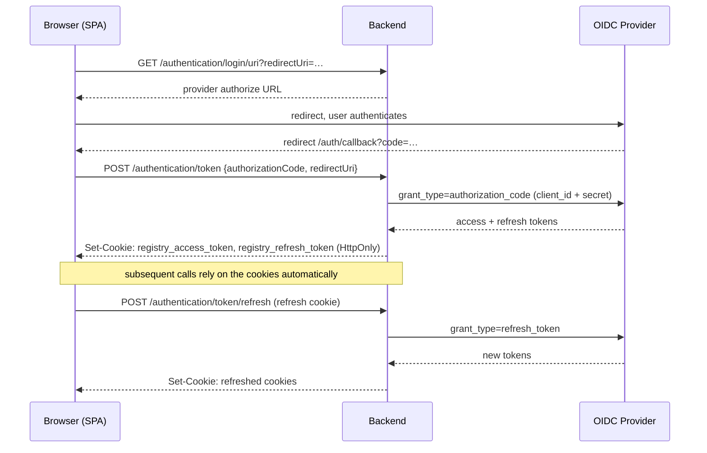
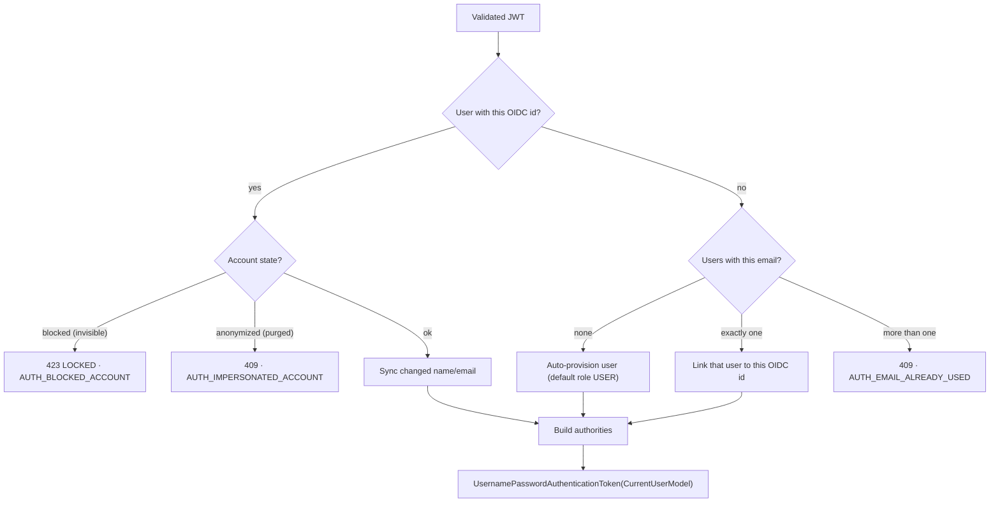

# Security

Registry delegates *authentication* to an external OIDC identity provider and enforces *authorization* itself, with a two-plane RBAC model that is stored as data and checked on every request. This page explains both halves and how they meet in the JWT-to-user conversion. The business-level roles and matrix live in [Functional → Roles & Permissions](/registry/functional/roles-and-permissions); this page is the enforcement view.

## Authentication

There is **no local password store**. The backend plays two OAuth2 roles at once:

- a **confidential client** — it brokers the authorization-code and refresh-token exchanges server-side, so the client secret never reaches the browser;
- a **resource server** — it validates the JWT on every protected call against the provider's JWKS endpoint.

Only four API endpoints on the main application port are public: `GET /authentication/login/uri`, `GET /authentication/logout/uri`, `POST /authentication/token`, and `POST /authentication/token/refresh` — the last two also sit behind a per-IP rate limit (see [Rate limiting](#rate-limiting)). Everything else on that port requires a valid JWT. CORS is restricted to a configured origin allowlist (`external.cors.urls`).

Health, metrics, and (when enabled) the OpenAPI/Swagger UI are **not** exposed on the main port at all — they only ever answer on a separate, unauthenticated **management port** (see [Network exposure & the management port](#network-exposure-the-management-port)).

### Login sequence



Provider errors are normalized: a 4xx from the provider becomes `401` (code outdated), a 5xx becomes `424 FAILED_DEPENDENCY` (`AUTH_PROVIDER_FAILED`). Every outbound call to the IdP (token exchange, refresh, revocation) runs through a bounded HTTP client — a capped connection pool plus a connect and a response timeout (`external.idp.connect-timeout-millis` / `.response-timeout-millis` / `.max-connections`) — so a slow or unresponsive provider degrades into that `424`, an accepted single point of failure ([ADR 004](/registry/technical/adr/004-oidc-resource-server-auth)), rather than tying up server resources indefinitely.

### Cookie-based session & CSRF protection

Tokens never reach browser JavaScript. `POST /authentication/token` and `POST /authentication/token/refresh` return no body — `AuthenticationCookieService` writes the tokens straight onto the response as two cookies, both `HttpOnly`, `SameSite=Lax`, and `Secure` unless explicitly disabled (`registry.security.cookie.secure`, defaults to `true` — must be turned off for plain-HTTP local development):

| Cookie | Path scope | Lifetime |
| ------ | ---------- | -------- |
| `registry_access_token` | the whole API prefix (`registry.server.prefix`) | the token's own `expires_in` |
| `registry_refresh_token` | the authentication sub-tree only (`{prefix}/v1/authentication`) | session cookie (cleared on logout) |

`CookieBearerTokenHandler` resolves the bearer token for Spring Security by trying the `Authorization` header first and falling back to the `registry_access_token` cookie — so the browser SPA authenticates purely on cookies while non-browser API clients (Swagger's "Authorize" flow, scripts, the seeded service account used for purge jobs) keep working with an explicit bearer header. `getLogoutUri` clears both cookies and best-effort revokes both tokens at the provider's revocation endpoint before returning the end-session URL.

Because the browser now carries credentials automatically, state-changing requests need CSRF protection. `CsrfTokenService` computes a **stateless** token as `HMAC-SHA256(idp-client-secret, accessToken)` — no server-side token store, no CSRF cookie: the expected value is simply recomputed from whichever access token the caller already presents. `CsrfTokenHeaderHandler` publishes it on every response as the `X-XSRF-TOKEN` header; the frontend interceptor captures it and echoes it back on the same header. A request must present a matching header when **all** of the following hold — otherwise it is rejected with `403` via the same `AuthorizationErrorHandler`:

- the HTTP method is not one of the safe methods (`GET`, `HEAD`, `OPTIONS`, `TRACE`);
- the caller did **not** authenticate with an `Authorization: Bearer` header (bearer-header clients are not vulnerable to CSRF, so they're exempt);
- the path isn't `/authentication/token` or `/authentication/token/refresh` (there is no prior access token to derive the check from at login time).

## JWT → application user

The custom `TokenConverterService` (registered as the JWT authentication converter) turns a validated token into the application principal, `CurrentUserModel`. It reads configurable claims (`sub` → OIDC id, plus `email`, `given_name`, `family_name`) and then:



The important behaviours: **first-time users are provisioned automatically** with the default `USER` role; a **pre-existing, not-yet-linked user row is claimed by email** on its owner's first login — matching that row's OIDC id to the token's `sub` instead of creating a duplicate (this is how seeded or pre-created accounts get attached to a real identity); **blocked and anonymized accounts are refused** at conversion time; and profile data is kept in sync with the provider on each login.

The resolved `CurrentUserModel` — including its authorities — is cached per OIDC id (`PrincipalCacheService`, an async Caffeine cache, `registry.security.oauth2.cache.principal.ttl-seconds`, default 60s) so a busy session doesn't repeat this lookup and authority build on every request. Any mutation that changes what a principal resolves to — a role or profile change, a project or project-profile deletion — explicitly invalidates the affected entries, so the cache never outlives its correctness window by more than the TTL.

## Authorization — two planes, stored as data

Roles and their permissions are **rows in the database** (seeded by migrations, e.g. `V1_0_1`, `V1_1_1`), loaded into an in-memory map when the application context starts. There are two planes ([ADR 005](/registry/technical/adr/005-db-driven-project-rbac)):

- **Global** authorities — the permission names of the user's global role (e.g. `REGISTRY_PROJECT_C`, `REGISTRY_USER_R`).
- **Project-scoped** authorities — for each accepted project profile, the role's permissions are granted as **namespaced strings**: `"{projectId}_{PERMISSION}"` (e.g. `a1b2…_REGISTRY_PROJECT_MOVEMENT_C`), plus one option authority per enabled module: `"{projectId}_REGISTRY_PROJECT_OPTION_{VEHICLE|ACTIVITY|COMMUNICATION|ALERT}"`.

Because a project permission is a project-prefixed string, holding it in one event grants nothing in another — this **string-namespacing is the multi-tenant isolation mechanism**.

### Enforcement

Authorization runs through Spring method security (`@EnableReactiveMethodSecurity`) with `@PreAuthorize` on every controller contract method:

| Expression | Resolves to |
| ---------- | ----------- |
| `hasAuthority('REGISTRY_USER_R')` | a direct global-authority check |
| `hasPermission(#projectId, 'REGISTRY_PROJECT_MOVEMENT_C')` | a custom `PermissionEvaluator` that checks whether the user holds the string `"{projectId}_REGISTRY_PROJECT_MOVEMENT_C"` |

A typical project-scoped, option-gated endpoint carries both an option check and a permission check, for example:

```kotlin
@PreAuthorize(
  "hasPermission(#projectId, 'REGISTRY_PROJECT_OPTION_VEHICLE') and " +
  "hasPermission(#projectId, 'REGISTRY_PROJECT_VEHICLE_C')"
)
```

### Visibility gating

When a project is disabled (made invisible), the authority builder withholds project authorities: non-administrators get **none**, and even an administrator keeps only `REGISTRY_PROJECT_R/U/D`. Option authorities are only granted while the project is visible. A disabled event is therefore effectively frozen except for the administrator's ability to read, re-enable, or delete it.

### Authorization errors

`AuthorizationErrorHandler` renders auth failures as a JSON `ErrorDto`: `401 NOT_AUTHENTICATED` (no/invalid credentials), `401 INVALID_TOKEN`, `403 NOT_ENOUGH_PERMISSION` (access denied, including a failed CSRF check), and the JWT-conversion errors above. Bodies are localized via the request locale.

## Network exposure & the management port

The application listens on **two ports**, each governed by its own Spring Security filter chain:

- **`registry.server.port`** (default `8081`) — the `/api/v1/**` surface described above: JWT-authenticated, CORS-restricted, CSRF-checked.
- **`registry.server.management-port`** (default `8082`) — Actuator (`health`, `prometheus`) and, when `registry.feature.documentation.enabled` is set, the OpenAPI/Swagger UI (`springdoc.use-management-port: true` moves both entirely off the main port). Everything reachable on this port is **`permitAll`, by design** — it carries no credential check of its own. The security boundary is deployment-level: this port is meant to stay off any public ingress and only be reachable from inside the cluster/network (e.g. for a scrape target or an internal health probe), never from the internet.

Both chains still apply the same **security headers** and are told apart purely by which port and path a request matched — a dedicated `ServerWebExchangeMatcher` compares `exchange.request.localAddress.port` against the configured management port, since Spring's path-based matchers alone can't distinguish the two.

### Security headers

Every response — on either port — carries:

- **Content-Security-Policy** — `default-src 'none'; frame-ancestors 'none'` on the API chain (a pure JSON API needs nothing), relaxed to `default-src 'self'; frame-ancestors 'none'` only for the management-port documentation chain, which has to serve Swagger UI's own static assets.
- **Permissions-Policy** — `geolocation=(), camera=(), microphone=(), payment=(), usb=(), interest-cohort=()`, denying every one of those browser features by default.
- **Strict-Transport-Security** — one year, `includeSubDomains`, `preload`.

These sit alongside the frontend's own hardening headers set at the nginx layer (see [Safe defaults & hardening](#safe-defaults-hardening)); API responses carry their own set independently of any gateway or nginx.

### Rate limiting

`AuthenticationRateLimitHandler` (a plain `WebFilter`, not part of Spring Security) caps `POST /authentication/token` and `POST /authentication/token/refresh` — the entire unauthenticated attack surface — with a per-client-IP sliding window, backed by an in-memory, per-instance Caffeine cache of counters ([ADR 012](/registry/technical/adr/012-per-instance-rate-limit-caffeine)). Limits are configurable (`registry.security.rate-limit.auth.capacity` / `.window-seconds`, defaulting to 10 requests per 60 seconds); a request over the limit gets `429 TOO_MANY_REQUESTS` with a `Retry-After` header. The limit is per running instance — running N replicas multiplies the effective global capacity by N, a known and accepted trade-off for not introducing a shared store.

## Data protection

- **Anonymization ("impersonate").** Anonymizing a user scrambles their name and email, clears their birthday, and marks the account `purged`; that OIDC identity can never sign in again. A user can anonymize their own account; a platform administrator can anonymize others. This is a soft-delete for data-protection compliance, not an account-switching feature.
- **Retention purges.** The purge endpoints require `REGISTRY_JOB_C`, which the seed data grants only to the `USER_ADMINISTRATOR` role (`V1_9_0`). A seeded, non-human user of type `SERVICE_ACCOUNT` — provisioned with that role — is what an external scheduler authenticates as to purge stale users, projects, contents and configurations past a configurable age threshold. There is no in-process scheduler; the jobs are driven by calls to `/api/v1/purge/**`.
- **Last-administrator safety.** The system refuses to remove or demote the last level-0 administrator of the platform, and the last *permanent* (no end date) level-0 administrator of a project — a temporary/support profile never counts toward this safeguard.

## Safe defaults & hardening

- The backend runs as a **non-root** user in a **distroless** image.
- The frontend is served by an **unprivileged nginx** with `X-Frame-Options`, HSTS, `X-Content-Type-Options`, and `server_tokens off`.
- Auth cookies are `HttpOnly` (unreadable from JavaScript), `SameSite=Lax`, and `Secure` by default — only disable `registry.security.cookie.secure` for plain-HTTP local development, never in a deployed environment.
- Outbound calls to the identity provider are bounded (connection pool cap, connect/response timeouts) so a stalled IdP can't exhaust server resources.
- Secrets (database credentials, OIDC client secret) are supplied through environment configuration, never baked into an image.
